Hypothesis 3
------------

This script tests hypothesis three: that planting tree seedlings, as
carried out by the USFS, will improve longterm tree regeneration
outcomes compared to adjacent sites with the same topographic position
and burn severity that did not receive planting. The dependent variable
is % change in forest area over the time between 1992 and 2016 within
stands (aka clusters) that have similar aspect and burn severity. This
varialbe was generated using NLCD data showing if each pixel is
classified as forest or not forest. The hypothesis was tested with a
differnces in differences approach whereby non-planted sites were
assumed to have the same rate of tree recovery in burned patches as
compared to adjacent control area (ie.. that didn't receive planting)
under the null hypothesis.

**Fire year**: 1987 **Study area**: The Klamath Ecoregion **Pixels
included**: Mixed conifer forest as classified by Landfire's biophysical
settings, identified as being conifer before the fire (as classified
from a random forest algorithm), that burned at medium or high severity
(MTBS), and that were classified as non-forest in 1992 from NLCD data 5
years after the fire. Essentially, the study pixels included experienced
stand-replacing fires in 1987 that occured in mixed conifer forest.

Stand-level recovery trajectories
---------------------------------

Also includes some visualizations of the % change in pixels classified
as forest in recovering stands

Comparisons of NBR across vegetation types
------------------------------------------

This script aslo includes some visualizations of NBR stratified by
vegetation type (as classified by NLCD)

NBR recovery trajectories
-------------------------

Also includes some NBR recovering trajectories

Install Packages

    library(tidyverse)

    ## ── Attaching packages ───────────────────────────────────────────────────────────────── tidyverse 1.3.0 ──

    ## ✓ ggplot2 3.3.0     ✓ purrr   0.3.3
    ## ✓ tibble  2.1.3     ✓ dplyr   0.8.5
    ## ✓ tidyr   1.0.2     ✓ stringr 1.4.0
    ## ✓ readr   1.3.1     ✓ forcats 0.5.0

    ## ── Conflicts ──────────────────────────────────────────────────────────────────── tidyverse_conflicts() ──
    ## x dplyr::filter() masks stats::filter()
    ## x dplyr::lag()    masks stats::lag()

    source('scripts/adams_theme.R') #for ggplot2
    source('scripts/adams_theme_v2.R')#for ggplot2

    select <- dplyr::select

Import data

    df <- read_csv('data/FireDataKlamath1987part1_v2.csv', col_types = cols(clusterID = col_factor())) %>%
      rbind(read_csv('data/FireDataKlamath1987part2_v2.csv', col_types = cols(clusterID = col_factor()))) %>%
      rbind(read_csv('data/FireDataKlamath1987part3_v2.csv', col_types = cols(clusterID = col_factor())))

    #this csv describe each ecotype code
    eco_type_codes <- read_csv('data/landfire_ecotype_codes.csv')

    ## Parsed with column specification:
    ## cols(
    ##   eco_type_code = col_double(),
    ##   eco_type_description = col_character()
    ## )

    n_pixels <- nrow(df) #number of pixels in the dataset 
    n_pixels

    ## [1] 32815

Some initial cleaning of the data

    df <- df %>%
      select(-`system:index`) %>%
      mutate(pixelID = as.character(1:n_pixels))

    names(df)

    ##   [1] "1985"      "1986"      "1987"      "1988"      "1989"      "1990"     
    ##   [7] "1991"      "1992"      "1993"      "1994"      "1995"      "1996"     
    ##  [13] "1997"      "1998"      "1999"      "2000"      "2001"      "2002"     
    ##  [19] "2003"      "2004"      "2005"      "2006"      "2007"      "2008"     
    ##  [25] "2009"      "2010"      "2011"      "2012"      "2013"      "2014"     
    ##  [31] "2015"      "2016"      "2017"      "FIRE_YEAR" "FireID"    "JanTMinF1"
    ##  [37] "JanTMinF2" "JanTMinF3" "JanTMinF4" "JanTMinF5" "JulTMaxF1" "JulTMaxF2"
    ##  [43] "JulTMaxF3" "JulTMaxF4" "JulTMaxF5" "NLCD1992"  "NLCD2001"  "NLCD2004" 
    ##  [49] "NLCD2006"  "NLCD2008"  "NLCD2011"  "NLCD2013"  "NLCD2016"  "TCC2000"  
    ##  [55] "TCC2005"   "TCC2010"   "WID"       "WSpptF1"   "WSpptF2"   "WSpptF3"  
    ##  [61] "WSpptF4"   "WSpptF5"   "aspect"    "b1"        "burnSev"   "clusterID"
    ##  [67] "distance"  "eastness"  "elevation" "facts1987" "facts1988" "facts1989"
    ##  [73] "facts1990" "facts1991" "facts1992" "facts1993" "facts1994" "facts1995"
    ##  [79] "facts1996" "facts1997" "facts1998" "facts1999" "facts2000" "facts2001"
    ##  [85] "facts2002" "facts2003" "facts2004" "facts2005" "facts2006" "facts2007"
    ##  [91] "facts2008" "facts2009" "facts2010" "facts2011" "facts2012" "facts2013"
    ##  [97] "facts2014" "facts2015" "facts2016" "facts2017" "facts2018" "northness"
    ## [103] "slope"     ".geo"      "pixelID"

Identifying patches with more than eight pixels. "Clusters" and
"Patches" are used interchangeably throughout the document.

    clusters_with_more_than8_pixels <- df %>% group_by(clusterID) %>%
      summarise(Npixels = length(unique(pixelID))) %>%
      filter(Npixels > 8) %>%
      pull(clusterID)

Creating a data frame that has the landcover classifications of each
pixel in years where the NLCD landcover data is available.

    landcover <- names(df)[grep(names(df), pattern = "NLCD")]

    df_lc <- df %>%
      select(pixelID, clusterID, landcover) %>%
      gather(landcover, key = "NLCD_year", value = "landcover_code") %>%
      mutate(land_cover_name = case_when(
        (landcover_code == 71) ~ "grass_herb",
        (landcover_code == 51) ~ "shrub",
        (landcover_code == 42) ~ "evergreen_forest",
        (landcover_code == 43) ~ "mixed forest",
        (landcover_code == 31) ~ "barren_land",
        (landcover_code == 23) ~ "developed",
        (landcover_code == 41) ~ "deciduous_forest",
        (landcover_code == 11) ~ "open_water",
        (landcover_code == 81) ~ "pasture_hay",
        (landcover_code == 33) ~ "transitional_barren",
        (landcover_code == 52) ~ "shrub",
        (landcover_code == 21) ~ "developed",
        (landcover_code == 95) ~ "emergent_herb_wetlands",
        (landcover_code == 90) ~ "woody_wetlands",
        (landcover_code == 22) ~ "developed"
      )) %>%
      mutate(year = as.numeric(gsub("NLCD", "", NLCD_year))) %>%
      arrange(clusterID)

    ## Note: Using an external vector in selections is ambiguous.
    ## ℹ Use `all_of(landcover)` instead of `landcover` to silence this message.
    ## ℹ See <https://tidyselect.r-lib.org/reference/faq-external-vector.html>.
    ## This message is displayed once per session.

    df_lc

    ## # A tibble: 262,520 x 6
    ##    pixelID clusterID NLCD_year landcover_code land_cover_name   year
    ##    <chr>   <fct>     <chr>              <dbl> <chr>            <dbl>
    ##  1 1       0         NLCD1992              42 evergreen_forest  1992
    ##  2 2       0         NLCD1992              71 grass_herb        1992
    ##  3 3       0         NLCD1992              42 evergreen_forest  1992
    ##  4 4       0         NLCD1992              42 evergreen_forest  1992
    ##  5 5       0         NLCD1992              42 evergreen_forest  1992
    ##  6 6       0         NLCD1992              71 grass_herb        1992
    ##  7 7       0         NLCD1992              71 grass_herb        1992
    ##  8 8       0         NLCD1992              71 grass_herb        1992
    ##  9 9       0         NLCD1992              42 evergreen_forest  1992
    ## 10 10      0         NLCD1992              42 evergreen_forest  1992
    ## # … with 262,510 more rows

Creating a tree canopy cover df in years where % tree canopy cover data
is available

    TCC <- names(df)[grep(names(df), pattern = "TCC")]

    df_tcc <- df %>%
      select(pixelID, clusterID, TCC) %>%
      gather(TCC, key = "TCCyear", value = "pct_TCC") %>% 
      mutate(year = as.numeric(gsub("TCC", "", TCCyear)))

    ## Note: Using an external vector in selections is ambiguous.
    ## ℹ Use `all_of(TCC)` instead of `TCC` to silence this message.
    ## ℹ See <https://tidyselect.r-lib.org/reference/faq-external-vector.html>.
    ## This message is displayed once per session.

    df_tcc

    ## # A tibble: 98,445 x 5
    ##    pixelID clusterID TCCyear pct_TCC  year
    ##    <chr>   <fct>     <chr>     <dbl> <dbl>
    ##  1 1       0         TCC2000      30  2000
    ##  2 2       0         TCC2000       1  2000
    ##  3 3       0         TCC2000      49  2000
    ##  4 4       0         TCC2000      61  2000
    ##  5 5       0         TCC2000      66  2000
    ##  6 6       0         TCC2000       0  2000
    ##  7 7       0         TCC2000       0  2000
    ##  8 8       0         TCC2000      57  2000
    ##  9 9       0         TCC2000      69  2000
    ## 10 10      0         TCC2000      54  2000
    ## # … with 98,435 more rows

Creating an NBR dataframe showing the NBR value in each pixel for each
year.

    years <- as.character(1985:2017)
    df_nbr <- df %>%
      select(pixelID, clusterID, years) %>%
      gather(years, key = "year_string", value = "NBR") %>%
      mutate(year = as.numeric(year_string)) %>%
      select(-year_string, -clusterID) 

    ## Note: Using an external vector in selections is ambiguous.
    ## ℹ Use `all_of(years)` instead of `years` to silence this message.
    ## ℹ See <https://tidyselect.r-lib.org/reference/faq-external-vector.html>.
    ## This message is displayed once per session.

    df_nbr 

    ## # A tibble: 1,082,895 x 3
    ##    pixelID   NBR  year
    ##    <chr>   <dbl> <dbl>
    ##  1 1        745.  1985
    ##  2 2        617.  1985
    ##  3 3        414.  1985
    ##  4 4        682.  1985
    ##  5 5        729.  1985
    ##  6 6        764.  1985
    ##  7 7        489.  1985
    ##  8 8        603.  1985
    ##  9 9        736.  1985
    ## 10 10       632.  1985
    ## # … with 1,082,885 more rows

Creating a FACTS df showing which pixels were planted with trees after
the 1987 fires

    facts_cols <- names(df)[grep(names(df), pattern = "facts")]
    df_facts <- df %>%
      select(pixelID, clusterID, facts_cols) %>%
      gather(facts_cols, key = "facts_year", value = "factsTreatmentCode") %>%
      mutate(factsTreatment = case_when(
        (factsTreatmentCode == 0) ~ "none",
        (factsTreatmentCode == 4431) ~ "plant_trees",
        (factsTreatmentCode == 4432) ~ "replant_or_fill"
      )) %>%
      mutate(year = as.numeric(gsub("facts", "", facts_year))) %>%
      arrange(clusterID)

    ## Note: Using an external vector in selections is ambiguous.
    ## ℹ Use `all_of(facts_cols)` instead of `facts_cols` to silence this message.
    ## ℹ See <https://tidyselect.r-lib.org/reference/faq-external-vector.html>.
    ## This message is displayed once per session.

    df_facts

    ## # A tibble: 1,050,080 x 6
    ##    pixelID clusterID facts_year factsTreatmentCode factsTreatment  year
    ##    <chr>   <fct>     <chr>                   <dbl> <chr>          <dbl>
    ##  1 1       0         facts1987                   0 none            1987
    ##  2 2       0         facts1987                   0 none            1987
    ##  3 3       0         facts1987                   0 none            1987
    ##  4 4       0         facts1987                   0 none            1987
    ##  5 5       0         facts1987                   0 none            1987
    ##  6 6       0         facts1987                   0 none            1987
    ##  7 7       0         facts1987                   0 none            1987
    ##  8 8       0         facts1987                   0 none            1987
    ##  9 9       0         facts1987                   0 none            1987
    ## 10 10      0         facts1987                   0 none            1987
    ## # … with 1,050,070 more rows

Merging dfs together

    #mering dfs together
    df <- df %>% select(pixelID, clusterID, FIRE_YEAR, FireID, burnSev, distance, northness, eastness, elevation, slope, b1, WID) %>%
      rename(ecotype_code = b1) %>%
      left_join(df_nbr, by = c("pixelID")) %>%
      left_join(df_lc,c("pixelID","year")) %>%
      left_join(df_facts,c("pixelID","year")) %>% 
      mutate(burnSevLong = case_when(
        (burnSev == 0) ~ "background/no_data",
        (burnSev == 1) ~ "verylow/no_burn",
        (burnSev == 2) ~ "low",
        (burnSev == 3) ~ "med",
        (burnSev == 4) ~ "high"
      )) %>% 
      mutate(eco_type = case_when(
        (ecotype_code == 549) ~ "MC_LM_Serp",
        (ecotype_code == 550) ~ "MC_UM_Serp",
        (ecotype_code == 551) ~ "MC_DrytoMes",
        (ecotype_code == 552) ~ "MC_Mes",
        (ecotype_code == 553) ~ "MixedOak",
        (ecotype_code == 554) ~ "MC_BO_LM",
        (ecotype_code == 555) ~ "Jeffrey_Ponderosa",
        (ecotype_code == 556) ~ "RedFir",
        (ecotype_code == 557) ~ "SubalpineWoodland",
        (ecotype_code == 558) ~ "Maritime_DFir_WHem"
      )) %>%
      filter(ecotype_code %in% eco_type_codes$eco_type_code) 

    df

    ## # A tibble: 1,003,068 x 24
    ##    pixelID clusterID.x FIRE_YEAR FireID burnSev distance northness eastness
    ##    <chr>   <fct>           <dbl> <chr>    <dbl>    <dbl>     <dbl>    <dbl>
    ##  1 1       0                1987 00000…       0        0    -0.563    0.827
    ##  2 1       0                1987 00000…       0        0    -0.563    0.827
    ##  3 1       0                1987 00000…       0        0    -0.563    0.827
    ##  4 1       0                1987 00000…       0        0    -0.563    0.827
    ##  5 1       0                1987 00000…       0        0    -0.563    0.827
    ##  6 1       0                1987 00000…       0        0    -0.563    0.827
    ##  7 1       0                1987 00000…       0        0    -0.563    0.827
    ##  8 1       0                1987 00000…       0        0    -0.563    0.827
    ##  9 1       0                1987 00000…       0        0    -0.563    0.827
    ## 10 1       0                1987 00000…       0        0    -0.563    0.827
    ## # … with 1,003,058 more rows, and 16 more variables: elevation <dbl>,
    ## #   slope <dbl>, ecotype_code <dbl>, WID <dbl>, NBR <dbl>, year <dbl>,
    ## #   clusterID.y <fct>, NLCD_year <chr>, landcover_code <dbl>,
    ## #   land_cover_name <chr>, clusterID <fct>, facts_year <chr>,
    ## #   factsTreatmentCode <dbl>, factsTreatment <chr>, burnSevLong <chr>,
    ## #   eco_type <chr>

    #adding the ecotype descriptions

Checking representation of forest types in our sample of pixels. The
majority are "mixed conifer dry to mesic", and "mixed conifer mesic".

    #representation of forest types
    df %>%
      group_by(eco_type) %>%
      summarise(number_pixels = length(unique(pixelID))) %>%
      drop_na() %>%
      mutate(sample_area_hectares = number_pixels * 900 / 10000) %>%
      ggplot(aes(eco_type, number_pixels)) +
      geom_bar(stat = "identity") +
      adams_theme +
      theme(axis.text.x = element_text(angle = 45, hjust = 1)) +
      ylab(label = "N pixels")

    total_sample_area <- length(unique(df$pixelID)) * 900 / 10e4 
    total_sample_area 

    ## [1] 273.564

    total_number_patches <- length(unique(df$clusterID))
    total_number_patches

    ## [1] 600

Exploring distribution of patch size in units of hectares and pixels in
our sample

    df %>%
      group_by(clusterID) %>%
      summarise(num_pixels_per_cluster = length(unique(pixelID))) %>%
      mutate(cluster_area = num_pixels_per_cluster * 900 / 10000) %>%
      pull(cluster_area) %>% summary()

    ## Warning: Factor `clusterID` contains implicit NA, consider using
    ## `forcats::fct_explicit_na`

    ##     Min.  1st Qu.   Median     Mean  3rd Qu.     Max. 
    ##    0.090    0.720    2.340    9.119    5.850 2735.640

    df %>%
      group_by(clusterID) %>%
      summarise(num_pixels_per_cluster = length(unique(pixelID))) %>%
      mutate(cluster_area = num_pixels_per_cluster * 900 / 10000) %>%
      ggplot(aes(num_pixels_per_cluster)) +
      geom_histogram() +
      xlim(c(0,100)) +
      adams_theme

    ## Warning: Factor `clusterID` contains implicit NA, consider using
    ## `forcats::fct_explicit_na`

    ## `stat_bin()` using `bins = 30`. Pick better value with `binwidth`.

    ## Warning: Removed 80 rows containing non-finite values (stat_bin).

    ## Warning: Removed 2 rows containing missing values (geom_bar).

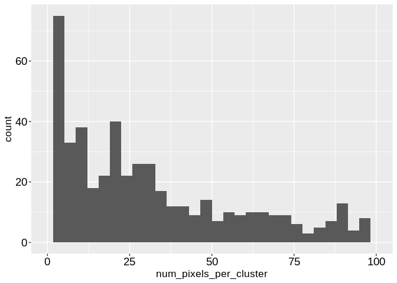

    length(unique(df$pixelID))

    ## [1] 30396

    length(unique(df$pixelID)) * 900 / 10e4

    ## [1] 273.564

Quantifying how many pixels went from non-forest back to forest in their
post-fire regeneration trajectory. These are the pixels of interest for
this analysis because we are not interested in pixels that were never
denuded of forest.

    `%notin%` <- Negate(`%in%`)

    nonForest2001 <- df %>%
      filter(year == 2001, landcover_code %notin% 41:43) %>%
      pull(pixelID) %>% unique()

    #how many pixels went from shrub to tree
    df %>%
      filter(pixelID %in% nonForest2001) %>%
      filter(year == 2016, landcover_code %in% 41:43) %>%
      pull(pixelID) %>% unique() %>% length()

    ## [1] 4576

Plotting the fraction of pixels in each patch that were classified as
forest in multiple years since the time of fire. The below plot shows
these fractions from 1992 to 2016 (the fire was in 1987).

    #create a data frame of the change in forest cover for each patch (cluster = patch)
    length(clusters_with_more_than8_pixels) # number of patches in the sample. Patches with less than 8 pixels were excluded.

    ## [1] 455

    patches <- sample(clusters_with_more_than8_pixels,100)

    df %>%
      filter(burnSev > 1) %>%
      filter(clusterID %in% clusters_with_more_than8_pixels) %>%
      drop_na(land_cover_name) %>%
      group_by(clusterID,year) %>%
      summarise(pct_tree = sum(landcover_code %in% 41:43) / length(landcover_code)) %>%
      filter(clusterID %in% patches) %>%
      ggplot(aes(year,pct_tree, group = clusterID)) +
      geom_point() +
      geom_line() +
      adams_theme +
      theme(legend.position = "none") +
      scale_x_continuous(n.breaks = 7, limits = c(1992,2016)) +
      ylab(label = "Tree Cover Fraction Per Patch")

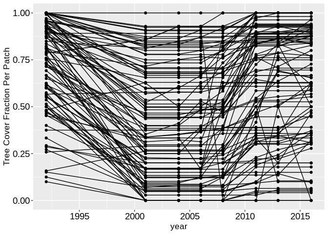

Whats the distribution of changes in the fractional area of tree cover
between 2016 and 1992 for the patches in our sample? Below we see that
most patches did not change their area of tree cover, while some
accumulated tree cover and some lost tree cover.

    #Calculating the patch-level dependent variable (% change in tree cover)
    patch_level_percent_change_in_forest_cover <- df %>%
      #filter(burnSev > 1) %>%
      filter(clusterID %in% clusters_with_more_than8_pixels) %>%
      drop_na(land_cover_name) %>%
      group_by(clusterID,year) %>%
      summarise(pct_tree = sum(landcover_code %in% 41:43) / length(landcover_code),
                n_pixels = length(unique(pixelID))) %>%
      group_by(clusterID) %>%
      summarise(pct_change_tree = pct_tree[year==2016] - pct_tree[year==1992],
                n_pixels = head(n_pixels,1))

    #plotting the distribution of changes in the fractional area of tree cover between 2016 and 1992 for the patches in our sample
    patch_level_percent_change_in_forest_cover %>%
     ggplot(aes(pct_change_tree)) +
      geom_histogram() +
      adams_theme +
      xlab(label = "% change in tree cover (1992-2016)")

    ## `stat_bin()` using `bins = 30`. Pick better value with `binwidth`.

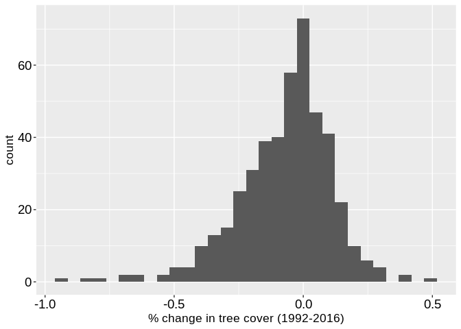

Pre-fire NBR is a measure of how much vegetation was in the pixel before
the fire.

    #creating pre-fire NBR values for each pixel
    pre_fire_nbr <- df %>% 
      filter(year %in% 1985:1986) %>%
      group_by(pixelID) %>%
      summarise(preFireNBR = mean(NBR))

    #adding the percent NBR recovery to the df
    df <- df %>%
      left_join(pre_fire_nbr) %>%
      mutate(pct_nbr_recovery = NBR / preFireNBR)

    ## Joining, by = "pixelID"

Calculating the patch-level continuous predictor vars

    patch_level_continuous_vars <- df %>%
      select(clusterID, pixelID, burnSev,northness,eastness,elevation,slope,preFireNBR, distance) %>%
      #mutate_at(vars(ecotype_code, factsTreatmentCode, WID),as.factor) %>%
      #filter(burnSev > 1) %>%
      filter(clusterID %in% clusters_with_more_than8_pixels) %>%
      group_by(clusterID) %>%
      summarise_if(is.numeric,mean)
    names(patch_level_continuous_vars)

    ## [1] "clusterID"  "burnSev"    "northness"  "eastness"   "elevation" 
    ## [6] "slope"      "preFireNBR" "distance"

Calculating the patch-level categorical predictor vars

    getmode <- function(x) {
       uniqv <- unique(x)
       uniqv[which.max(tabulate(match(x, uniqv)))]
    }

    patch_level_categorical_vars <- df %>%
      select(clusterID,pixelID,ecotype_code, eco_type, factsTreatmentCode, WID) %>%
      mutate_at(vars(ecotype_code, eco_type, factsTreatmentCode, WID),as.factor) %>%
      #filter(burnSev > 1) %>%
      filter(clusterID %in% clusters_with_more_than8_pixels) %>%
      group_by(clusterID) %>%
      summarise_if(is.factor,getmode) 

    #instead of calculating the mode of the facts treatments in each patch, here we create another variable that says a patch is "treated" (i.e. logical value of `1`) if any pixel in the patch was treated.

    facts_treatment_df_v2 <- df %>%
      select(clusterID,pixelID,factsTreatmentCode) %>%
      group_by(clusterID) %>%
      summarise(factsTreatment = max(factsTreatmentCode)) %>%
      mutate(factsTreatmentLogical = factor(as.numeric(factsTreatment > 1)))

    ## Warning: Factor `clusterID` contains implicit NA, consider using
    ## `forcats::fct_explicit_na`

    patch_level_categorical_vars <-patch_level_categorical_vars %>%
      left_join(facts_treatment_df_v2)

    ## Joining, by = "clusterID"

    #names(patch_level_categorical_vars)

Joining patch-level dataframes to have the continuous predictor vars,
the categorical predictor vars, and the dependent variables in one df.

    patch_data  <- patch_level_percent_change_in_forest_cover %>%
      left_join(patch_level_continuous_vars, by = "clusterID") %>%
      left_join(patch_level_categorical_vars, by = "clusterID") %>%
      select(-clusterID, -n_pixels)

    patch_data

    ## # A tibble: 454 x 14
    ##    pct_change_tree burnSev northness eastness elevation slope preFireNBR
    ##              <dbl>   <dbl>     <dbl>    <dbl>     <dbl> <dbl>      <dbl>
    ##  1         -0.0215 0.00499    0.0298   0.0264     1079.  19.2       597.
    ##  2         -0.0833 1.08      -0.774    0.627      1629.  28.0       653.
    ##  3         -0.375  3.31       0.643    0.731      1177.  26.8       536.
    ##  4         -0.105  3.32       0.395    0.850      1153.  26.4       481.
    ##  5         -0.20   3.1        0.365    0.914      1023   27.9       479.
    ##  6         -0.05   3.55       0.0851   0.866      1088.  26.2       494.
    ##  7         -0.198  1.95      -0.719    0.322       691.  24.5       624.
    ##  8         -0.0820 1.90      -0.664   -0.251       676.  23.1       715.
    ##  9         -0.337  2.13      -0.884   -0.271       791.  27.5       636.
    ## 10          0      2         -0.913   -0.211       516.  20.9       731.
    ## # … with 444 more rows, and 7 more variables: distance <dbl>,
    ## #   ecotype_code <fct>, eco_type <fct>, factsTreatmentCode <fct>, WID <fct>,
    ## #   factsTreatment <dbl>, factsTreatmentLogical <fct>

    names(df)

    ##  [1] "pixelID"            "clusterID.x"        "FIRE_YEAR"         
    ##  [4] "FireID"             "burnSev"            "distance"          
    ##  [7] "northness"          "eastness"           "elevation"         
    ## [10] "slope"              "ecotype_code"       "WID"               
    ## [13] "NBR"                "year"               "clusterID.y"       
    ## [16] "NLCD_year"          "landcover_code"     "land_cover_name"   
    ## [19] "clusterID"          "facts_year"         "factsTreatmentCode"
    ## [22] "factsTreatment"     "burnSevLong"        "eco_type"          
    ## [25] "preFireNBR"         "pct_nbr_recovery"

Exploring correlations between variables

    library(ggcorrplot)

    corr <- patch_data %>%
      select_if(is.numeric) %>%
      cor() %>% round(1)

    Pmat <- patch_data %>%
      select_if(is.numeric) %>%
      cor_pmat()

    ggcorrplot(corr, hc.order = TRUE, type = "lower",
       lab = TRUE, p.mat = Pmat)

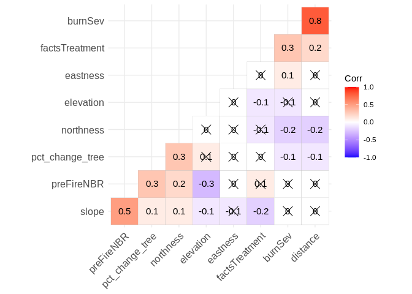

Analyzing forest recovery by forest type. The majority of forest types
continue to lose forest cover even 5 years after the fire. The Mixed
Conifer Mesic Forest type appears to have the most promising forest
regeneration.

    patch_data %>%
      ggplot(aes(x = eco_type,y = pct_change_tree)) +
      geom_boxplot() +
      ylab(label = "% change in tree cover (1992-2016)") +
      theme(axis.text.x = element_text(angle = 45, hjust = 1))

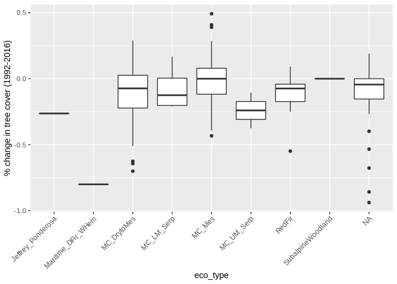

Analyzing the effect of the USFS planting trees on the future
physiognomic class in fire-affected pixels using data from the Forest
Activity Tracking System dataset.

A first look at % of pixels transitioning from non-forest to forest in
treated (planted) and untreated pixels.

    nonforest1992 <- df %>% 
      select(pixelID, year, landcover_code, factsTreatmentCode) %>%
      filter(year == 1992, landcover_code %notin% 41:43) %>% pull(pixelID)
    forest2016 <- df %>% 
      select(pixelID, year, landcover_code, factsTreatmentCode) %>%
      filter(year == 2016, landcover_code %in% 41:43) %>% pull(pixelID)
    transition2forest <- unique(df$pixelID[(df$pixelID %in% nonforest1992) & (df$pixelID %in% forest2016)])

    #transition2forest
    df %>%
      select(pixelID, year, landcover_code, factsTreatmentCode) %>%
      mutate(transitioned = pixelID %in% transition2forest) %>%
      mutate(planting = factsTreatmentCode %in% c(4431,4432)) %>%
      group_by(pixelID) %>%
      summarise(transitioned = max(transitioned), planted = max(planting)) %>%
      group_by(planted) %>%
      summarise(percent_trans = sum(transitioned) / length(transitioned), n = length(transitioned)) %>%
      ggplot(aes(factor(planted),percent_trans)) +
      geom_bar(stat = "identity") +
      ylab(label = "percent of pixels regenerating back to forest") +
      xlab(label = "not planted = 0, planted = 1")

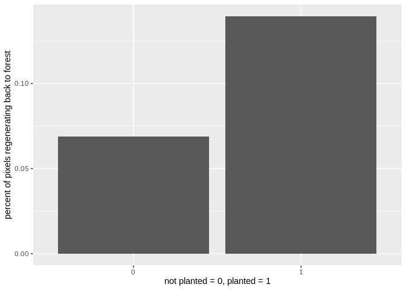

Setting up a datafram to test the difference in differences between
paired control and planted pixels. Groups of pixels that are in the same
patch, but that differ in their treatement (planted vs. not planted) are
matched.

    facts_treatment_df <- df %>%
      filter(year > 1986) %>%
      select(clusterID, pixelID, year, landcover_code, factsTreatmentCode) %>%
      mutate(transitioned = pixelID %in% transition2forest) %>%
      mutate(planting = factsTreatmentCode %in% c(4431,4432)) %>%
      #filter(clusterID %in% cluster_with_treatment) %>%
      group_by(pixelID) %>% summarise(clusterID = first(clusterID), tr = first(transitioned), pl = max(planting)) %>%
      group_by(clusterID,pl) %>% summarise(n_tr = sum(tr), n = length(tr)) %>%
      mutate(frac_tr = n_tr / n) %>%
      mutate(lnfrac_tr = log(frac_tr + 0.000001)) %>%
      mutate(treatment = case_when(
        (pl == 0 ~ "control"),
        (pl == 1 ~ "planted")
      ))

    #treatGroup <- plantedVSnot %>% filter(pl == 1) %>% pull(frac_tr)

    #ControlGroup <- plantedVSnot %>% filter(pl == 0) %>% pull(frac_tr)

Visualizing data

    plantingVSnot <- facts_treatment_df %>%
      ggplot(aes(factor(treatment),frac_tr)) +
      geom_boxplot() +
      stat_summary(fun = mean, geom="point",colour="darkred", size=3) +
      ylab("% of stand returning to forest") +
      xlab("") +
      adams_theme2

    # outOfSampleTest %>%
    #   ggplot(aes(conifer,prediction)) +
    #   geom_boxplot()+ 
    #   ylab(label = "Predicted Prob. Conifer") +
    #   xlab(label = "Reference (Not Conifer vs. Conifer)") +
    #   adams_theme2 
    # 
    #   
    png(filename = "~/cloud/gdrive/fire_project/DS421_proj/output/plantingVSnot.png", height=5, width=8, units="in", res = 100)
    plantingVSnot
    dev.off()

    ## png 
    ##   2

    plantingVSnot 

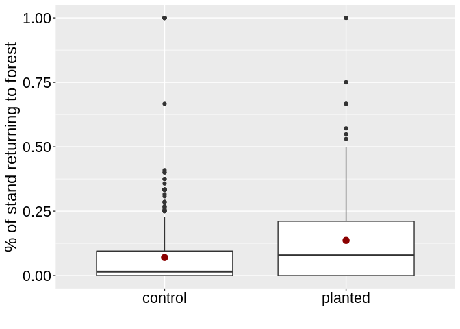

The dependent variable (y axis in figure above) needs to be log
transformed for statistical analysis because it is not normally
distributed. A log transform resolves this.

    facts_treatment_df %>%
    ggplot(aes(frac_tr)) +
    geom_histogram()

    ## `stat_bin()` using `bins = 30`. Pick better value with `binwidth`.

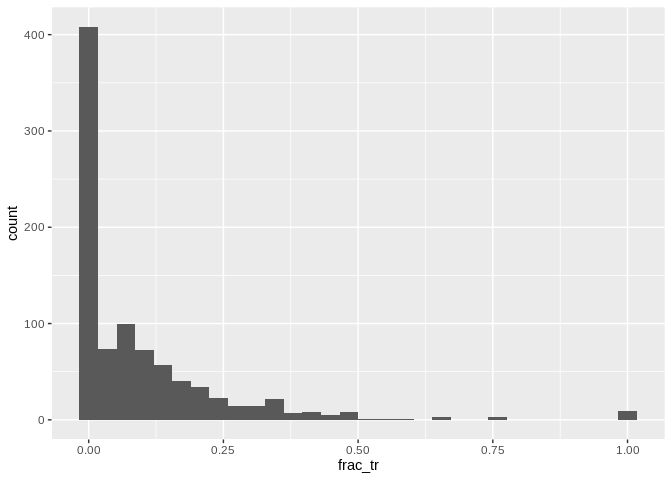

    facts_treatment_df %>%
    ggplot(aes(log(frac_tr))) +
    geom_histogram()

    ## `stat_bin()` using `bins = 30`. Pick better value with `binwidth`.

    ## Warning: Removed 394 rows containing non-finite values (stat_bin).

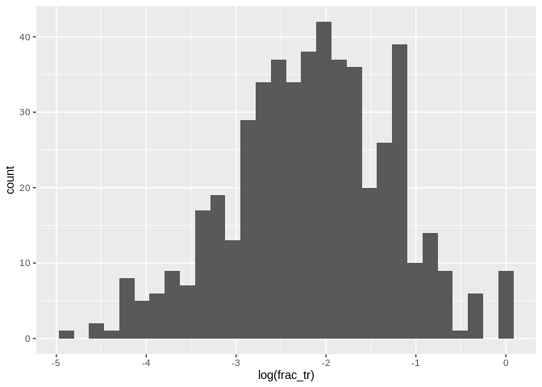

A paired t-test shows that planting does increase forest regeneration 30
years after fire.

    clusters_with_treatment <- facts_treatment_df %>%
      drop_na(clusterID) %>%
      group_by(clusterID) %>%
      summarise(nb = length(n)) %>%
      filter(nb > 1) %>% pull(clusterID)

    facts_treatment_df %>% filter(clusterID %in% clusters_with_treatment)

    ## # A tibble: 608 x 7
    ## # Groups:   clusterID [304]
    ##    clusterID      pl  n_tr     n frac_tr lnfrac_tr treatment
    ##    <fct>       <int> <int> <int>   <dbl>     <dbl> <chr>    
    ##  1 0               0   129  2003  0.0644     -2.74 control  
    ##  2 0               1    37   202  0.183      -1.70 planted  
    ##  3 -1121539616     0     0     4  0         -13.8  control  
    ##  4 -1121539616     1     1     8  0.125      -2.08 planted  
    ##  5 -220987546      0     0     2  0         -13.8  control  
    ##  6 -220987546      1     0     2  0         -13.8  planted  
    ##  7 -710819746      0     3   166  0.0181     -4.01 control  
    ##  8 -710819746      1     0     1  0         -13.8  planted  
    ##  9 -1768238605     0     0    84  0         -13.8  control  
    ## 10 -1768238605     1     0     8  0         -13.8  planted  
    ## # … with 598 more rows

    t.test(lnfrac_tr ~ pl, 
           data = facts_treatment_df %>% filter(clusterID %in% clusters_with_treatment),
           paired = TRUE)

    ## 
    ##  Paired t-test
    ## 
    ## data:  lnfrac_tr by pl
    ## t = -4.1462, df = 303, p-value = 4.393e-05
    ## alternative hypothesis: true difference in means is not equal to 0
    ## 95 percent confidence interval:
    ##  -2.3609276 -0.8411826
    ## sample estimates:
    ## mean of the differences 
    ##               -1.601055

But, in what scenarios does planting help the most compared to control?
The correlation plot below suggests that "tr\_diff" (the difference in
the % of pixels transitioning back to forest between the treatment group
and the paired control group) is positively correlated with slope,
eastness, and pre-Fire NBR value. Therefore, we can assume that planting
helps regeneration the most on steeper slopes, east-facing slopes, and
in locations where there was thicker vegetation before the fire. This
last variable could be a proxy for "site potential".

    facts_cor_data <- facts_treatment_df %>% 
      filter(clusterID %in% clusters_with_treatment) %>%
      select(-n_tr, -n,-lnfrac_tr, -pl) %>%
      spread(key = treatment, value = frac_tr) %>%
      mutate(tr_diff = planted - control) %>%
      select(-control,-planted) %>%
      left_join(patch_level_continuous_vars, by = "clusterID") %>%
      left_join(patch_level_categorical_vars, by = "clusterID") %>%
      ungroup %>%
      select(-factsTreatmentCode, -clusterID) %>%
      select_if(is.numeric) %>%
      drop_na()

    corr <- facts_cor_data %>%
      select_if(is.numeric) %>%
      cor() %>% round(1)

    Pmat <- facts_cor_data %>%
      select_if(is.numeric) %>%
      cor_pmat()

    ggcorrplot(corr, hc.order = TRUE, type = "lower",
       lab = TRUE, p.mat = Pmat)

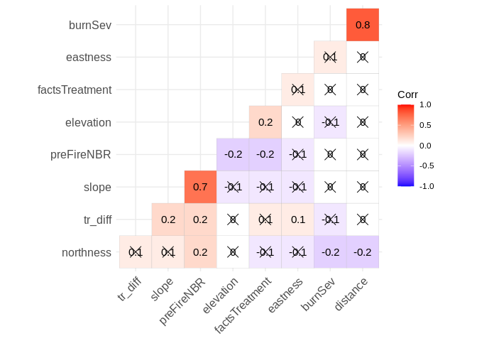

    facts_cor_data %>%
      ggplot(aes(x = preFireNBR, y = tr_diff)) +
      geom_point()

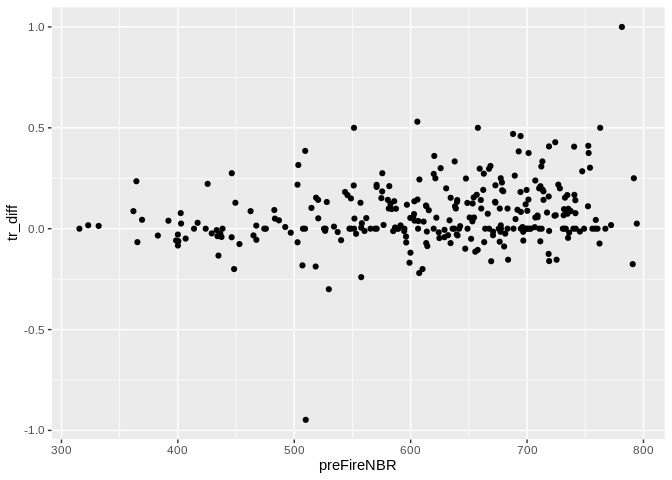

Appendix. Exploring NBR recovery over time.
-------------------------------------------

Adding the % NBR recovey to the df. %NBR recovery is the fraction of
mean pre-fire NBR

Showing the distribution of NBR values for pixels classified as forest
for NLCD

    df %>%
      drop_na(land_cover_name) %>%
      filter(landcover_code %in% c(41:42, 71,51,52)) %>%
      ggplot(aes(x=NBR, fill=land_cover_name)) +
      geom_density( color="#e9ecef", alpha=0.6, position = 'identity') +
      scale_fill_manual(values=c("light green", "dark green", "yellow", "brown")) +
      #theme_ipsum() +
      labs(fill="") +
      adams_theme

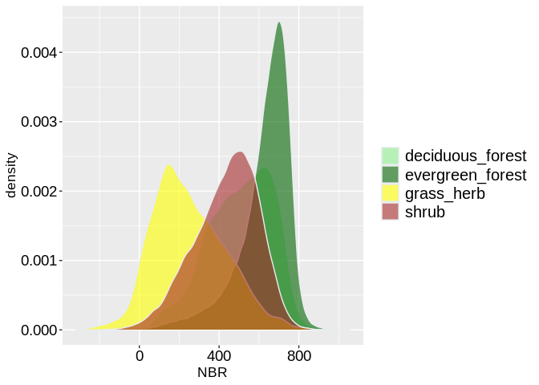

Plotting the patch-level NBR through time for a random sample of
patches. We see that NBR starts to saturate (i.e. reach the pre-fire NBR
value) within about 10-15 years. This is despite the fact that pixels
have not actually returned to forest. This is evidence that using NBR is
not suitable of measuring forest recovery.

    #patches <- sample(unique(df$clusterID),100)

    df %>%
      group_by(FireID, clusterID, year) %>%
      summarise_if(is.numeric,mean) %>%
      #filter(clusterID %in% patches) %>%
      ggplot(aes(year,NBR,color = clusterID)) +
      geom_line() +
      adams_theme +
      theme(legend.position = "none")

    ## Warning: Factor `clusterID` contains implicit NA, consider using
    ## `forcats::fct_explicit_na`

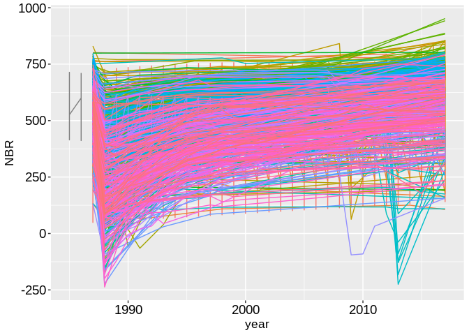

Plotting the percent NBR recovery for each patch. This shows NBR as a
percent of the pre-fire values.

    #patches <- sample(unique(df$clusterID),10)
    df %>%
      group_by(clusterID, year) %>%
      #filter(WID > 0) %>%
      summarise_if(is.numeric,mean) %>%
      #filter(clusterID %in% patches) %>%
      ggplot(aes(year,pct_nbr_recovery,color = clusterID)) +
      geom_line() +
      ylim(c(-1,1.5)) +
      adams_theme +
      theme(legend.position = "none")

    ## Warning: Factor `clusterID` contains implicit NA, consider using
    ## `forcats::fct_explicit_na`

    ## Warning: Removed 625 row(s) containing missing values (geom_path).

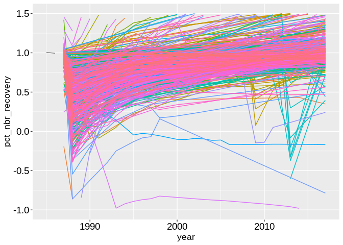

Histogram of percent recovery in 2000 (6 years after fire)

    df %>%
      group_by(pixelID, year) %>%
      summarise_if(is.numeric,mean) %>%
      filter(year == 1992) %>%
      ggplot(aes(x = pct_nbr_recovery, fill = factor(burnSev))) +
      geom_density(alpha=0.6, position = 'identity') +
      scale_fill_brewer(palette = "Reds") +
      xlim(c(-0.2,2)) +
      xlab(label = "% NBR Recovery 5 years post-fire") +
      adams_theme +
      labs(fill="Burn Severity") 

    ## Warning: Removed 397 rows containing non-finite values (stat_density).

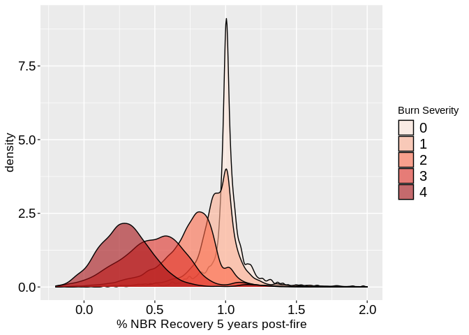

Density plot of percent recovery in 2017 (23 years after fire)

    df %>%
      group_by(pixelID, year) %>%
      summarise_if(is.numeric,mean) %>%
      filter(year == 2017) %>%
      ggplot(aes(x = pct_nbr_recovery, fill = factor(burnSev))) +
      geom_density(alpha=0.6, position = 'identity') +
      scale_fill_brewer(palette = "Reds") +
      xlim(c(-0.2,2)) +
      xlab(label = "% NBR Recovery 30 years post-fire") +
      adams_theme +
      labs(fill="Burn Severity") 

    ## Warning: Removed 1108 rows containing non-finite values (stat_density).

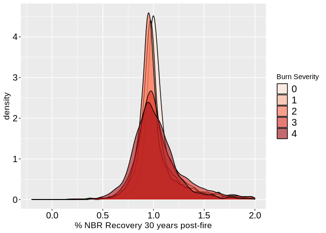

Creating variables showing the percent NBR recovery in 92,97,2017

    df <- df %>%
      filter(pct_nbr_recovery >= -10)

    pctNBRrec2017 <- df %>%
      filter(year == 2017) %>%
      select(pixelID, pct_nbr_recovery) %>%
      rename(pct_nbr_recovery_2017 = pct_nbr_recovery)

    pctNBRrec1997 <- df %>%
      filter(year == 1997) %>%
      select(pixelID, pct_nbr_recovery) %>%
      rename(pct_nbr_recovery_1997 = pct_nbr_recovery)

    pctNBRrec1992 <- df %>%
      filter(year == 1992) %>%
      select(pixelID, pct_nbr_recovery) %>%
      rename(pct_nbr_recovery_1992 = pct_nbr_recovery)

    df <- df %>%
      left_join(pctNBRrec2017) %>%
      left_join(pctNBRrec1997) %>%
      left_join(pctNBRrec1992)

    ## Joining, by = "pixelID"
    ## Joining, by = "pixelID"
    ## Joining, by = "pixelID"

Showing the perecent NBR recovery by burn severity class (10 years after
fire)

    # df %>%
    #   ggplot(aes(factor(burnSev), pct_nbr_recovery_1997)) +
    #   geom_boxplot() +
    #   ylim(c(0.2,1.5))

Showing the perecent NBR recovery by burn severity class (30 years after
fire)

    # df %>%
    #   ggplot(aes(factor(burnSev), pct_nbr_recovery_2017)) +
    #   geom_boxplot() +
    #   ylim(c(0.2,1.5))

Showing the relationship between distance (to the edge of a medium /
high severity burned area) and % NBR recovery in 2017 (26 years after
fire). This is commented out because it was crashing R studio.

    # pre_fire_pixels_forest <- df %>% filter(year == 1992, landcover_code %in% 41:42) %>% pull(pixelID) 
    # 
    # df %>%
    #   filter(pixelID %in% pre_fire_pixels_forest) %>%
    #   filter(burnSev >= 3) %>%
    #   ggplot(aes(distance, pct_nbr_recovery_2017)) +
    #   geom_point() +
    #   scale_x_continuous() +
    #   scale_y_continuous() +
    #   xlim(c(0,500)) +
    #   adams_theme

    # outOfSampleTest %>%
    #   ggplot(aes(conifer,prediction)) +
    #   geom_boxplot()+ 
    #   ylab(label = "Predicted Prob. Conifer") +
    #   xlab(label = "Reference (Not Conifer vs. Conifer)") +
    #   adams_theme2 
    # 
    #   
    # png(filename = "~/cloud/gdrive/fire_project/DS421_proj/output/prediction_fig.png", height=5, width=8, units="in", res = 100)
    # prediction_fig
    # dev.off()
