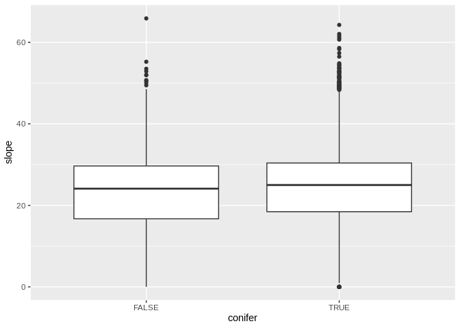

Hypothesis 2
------------

This script tests hypothesis two: A combination of topography, climate,
fire, and management variables will predict the probability of conifer
canopy dominance 30 yrs after fire.

The dependent variable is boolean: whether or not a post-fire pixel is
classified as being confier or not conifer (using a random forest
algorithm).

**Fire year**: 1987 **Study area**: The Klamath Ecoregion **Pixels
included**: Mixed conifer forest as classified by Landfire's biophysical
settings, identified as being conifer before the fire (as classified
from a random forest algorithm), that burned at medium or high severity
(MTBS), and that did not subsequently burn. Essentially, the study
pixels included experienced stand-replacing fires in 1987 that occured
in mixed conifer forest.

Install Packages

    library(tidyverse)

    ## ── Attaching packages ────────────────────────────────────────────────────────────────────────────── tidyverse 1.3.0 ──

    ## ✓ ggplot2 3.3.0     ✓ purrr   0.3.3
    ## ✓ tibble  2.1.3     ✓ dplyr   0.8.5
    ## ✓ tidyr   1.0.2     ✓ stringr 1.4.0
    ## ✓ readr   1.3.1     ✓ forcats 0.5.0

    ## ── Conflicts ───────────────────────────────────────────────────────────────────────────────── tidyverse_conflicts() ──
    ## x dplyr::filter() masks stats::filter()
    ## x dplyr::lag()    masks stats::lag()

    library(foreign)
    source('scripts/adams_theme.R')
    source('scripts/adams_theme_v2.R')#for ggplot2
    library(sf)

    ## Linking to GEOS 3.6.2, GDAL 2.2.3, PROJ 4.9.3

    library(caret)

    ## Loading required package: lattice

    ## 
    ## Attaching package: 'caret'

    ## The following object is masked from 'package:purrr':
    ## 
    ##     lift

Import data

    df <- readRDS('data/cleanDataApril20_v3.Rds')
    #this csv describe each ecotype code

    str(df)

    ## Classes 'tbl_df', 'tbl' and 'data.frame':    65762 obs. of  28 variables:
    ##  $ ID                       : int  1 2 3 4 5 6 7 8 9 10 ...
    ##  $ x                        : num  464595 464505 464475 464505 464535 ...
    ##  $ y                        : num  4644435 4644375 4644345 4644345 4644345 ...
    ##  $ burnSev                  : num  3 3 3 4 3 3 3 3 3 3 ...
    ##  $ forestType               : num  552 556 556 552 552 552 552 556 552 556 ...
    ##  $ SAP_surv_conifers        : num  0.434 0.483 0.488 0.463 0.439 ...
    ##  $ SAP_burn                 : num  0.0995 0.1808 0.208 0.2188 0.2242 ...
    ##  $ elevation                : num  1566 1609 1613 1614 1601 ...
    ##  $ slope                    : num  22.32 16.42 10.52 3.85 26.2 ...
    ##  $ aspect                   : num  47.9 351.5 290.4 103.9 103.3 ...
    ##  $ northness                : num  0.67 0.989 0.349 -0.241 -0.23 ...
    ##  $ eastness                 : num  0.742 -0.148 -0.937 0.971 0.973 ...
    ##  $ CWD                      : num  446 446 446 446 446 ...
    ##  $ AvGppt                   : num  1531 1531 1531 1531 1531 ...
    ##  $ AvGTemp                  : num  120 120 120 120 120 ...
    ##  $ SolarLoad                : num  90 195 195 195 146 138 195 144 219 167 ...
    ##  $ SUID                     : chr  NA NA NA NA ...
    ##  $ landfire2016             : num  7028 7028 7028 7028 7028 ...
    ##  $ plantedFirst5Years       : num  0 0 0 0 0 0 0 0 0 0 ...
    ##  $ plant_date               : Date, format: NA NA ...
    ##  $ SPB                      : num  0 0 0 0 0 0 0 0 0 0 ...
    ##  $ SPO                      : num  0 0 0 0 0 0 0 0 0 0 ...
    ##  $ SPMec                    : num  0 0 0 0 0 0 0 0 0 0 ...
    ##  $ plantedAfter5Yrs         : num  0 0 0 0 0 0 0 0 0 0 ...
    ##  $ latestSurveyNatDensity   : num  NA NA NA NA NA NA NA NA NA NA ...
    ##  $ certified_plantedIn6Years: num  NA NA NA NA NA NA NA NA NA NA ...
    ##  $ LAND_SUITA               : num  NA NA NA NA NA NA NA NA NA NA ...
    ##  $ PRODUCTIVI               : num  NA NA NA NA NA NA NA NA NA NA ...

    eco_type_codes <- read_csv('data/landfire_ecotype_codes.csv')

    ## Parsed with column specification:
    ## cols(
    ##   eco_type_code = col_double(),
    ##   eco_type_description = col_character()
    ## )

    landfire_codes <- foreign::read.dbf("data/US_200EVT\\US_200EVT.dbf")
    landfire_codes <- landfire_codes %>% dplyr::select(VALUE,EVT_PHYS) %>% rename(landfire2016 = VALUE)
    n_pixels <- nrow(df) #number of pixels in the dataset 
    n_pixels

    ## [1] 65762

    #cleaning
    df <- df %>%
      left_join(landfire_codes) %>%
      mutate(conifer = case_when(
        (EVT_PHYS == "Conifer" | EVT_PHYS == "Conifer-Hardwood") ~ TRUE,
        TRUE ~ FALSE
      ))

    ## Joining, by = "landfire2016"

    #str(df)

exporting fields to make field descriptions

    #names(df) %>% as.tibble() %>% write_csv(path = "data/data_fields.csv")

creating dataframe at the SUID level

    # SUID_df <- df %>%
    #   mutate_at(.vars = "SUID", .funs = as.factor) %>%
    #   drop_na(SUID) %>%
    #   group_by(SUID) %>%
    #   summarise_if(.predicate = is.numeric, .funs = mean) 

defining and reclassing variables

    continuous_predvars <- names(df)[c(6:16)]
    categorical_predvars <- names(df)[c(4,5,27,28)]
    boolean_predvars <- names(df)[c(19,21,22,23,24,26)]
    depVars <- names(df)[c(25,29,30)]

    df <- df %>%
      mutate_at(.vars = vars(boolean_predvars), .funs = as.logical) %>%
      mutate_at(.vars = vars(categorical_predvars), .funs = as.factor) %>%
      mutate_at(.vars = "SUID",.funs = as.factor)

    ## Note: Using an external vector in selections is ambiguous.
    ## ℹ Use `all_of(boolean_predvars)` instead of `boolean_predvars` to silence this message.
    ## ℹ See <https://tidyselect.r-lib.org/reference/faq-external-vector.html>.
    ## This message is displayed once per session.

    ## Note: Using an external vector in selections is ambiguous.
    ## ℹ Use `all_of(categorical_predvars)` instead of `categorical_predvars` to silence this message.
    ## ℹ See <https://tidyselect.r-lib.org/reference/faq-external-vector.html>.
    ## This message is displayed once per session.

    str(df)

    ## Classes 'tbl_df', 'tbl' and 'data.frame':    65762 obs. of  30 variables:
    ##  $ ID                       : int  1 2 3 4 5 6 7 8 9 10 ...
    ##  $ x                        : num  464595 464505 464475 464505 464535 ...
    ##  $ y                        : num  4644435 4644375 4644345 4644345 4644345 ...
    ##  $ burnSev                  : Factor w/ 2 levels "3","4": 1 1 1 2 1 1 1 1 1 1 ...
    ##  $ forestType               : Factor w/ 7 levels "549","550","551",..: 4 6 6 4 4 4 4 6 4 6 ...
    ##  $ SAP_surv_conifers        : num  0.434 0.483 0.488 0.463 0.439 ...
    ##  $ SAP_burn                 : num  0.0995 0.1808 0.208 0.2188 0.2242 ...
    ##  $ elevation                : num  1566 1609 1613 1614 1601 ...
    ##  $ slope                    : num  22.32 16.42 10.52 3.85 26.2 ...
    ##  $ aspect                   : num  47.9 351.5 290.4 103.9 103.3 ...
    ##  $ northness                : num  0.67 0.989 0.349 -0.241 -0.23 ...
    ##  $ eastness                 : num  0.742 -0.148 -0.937 0.971 0.973 ...
    ##  $ CWD                      : num  446 446 446 446 446 ...
    ##  $ AvGppt                   : num  1531 1531 1531 1531 1531 ...
    ##  $ AvGTemp                  : num  120 120 120 120 120 ...
    ##  $ SolarLoad                : num  90 195 195 195 146 138 195 144 219 167 ...
    ##  $ SUID                     : Factor w/ 360 levels "0505511090020000000",..: NA NA NA NA NA NA NA NA NA NA ...
    ##  $ landfire2016             : num  7028 7028 7028 7028 7028 ...
    ##  $ plantedFirst5Years       : logi  FALSE FALSE FALSE FALSE FALSE FALSE ...
    ##  $ plant_date               : Date, format: NA NA ...
    ##  $ SPB                      : logi  FALSE FALSE FALSE FALSE FALSE FALSE ...
    ##  $ SPO                      : logi  FALSE FALSE FALSE FALSE FALSE FALSE ...
    ##  $ SPMec                    : logi  FALSE FALSE FALSE FALSE FALSE FALSE ...
    ##  $ plantedAfter5Yrs         : logi  FALSE FALSE FALSE FALSE FALSE FALSE ...
    ##  $ latestSurveyNatDensity   : num  NA NA NA NA NA NA NA NA NA NA ...
    ##  $ certified_plantedIn6Years: logi  NA NA NA NA NA NA ...
    ##  $ LAND_SUITA               : Factor w/ 5 levels "600","640","670",..: NA NA NA NA NA NA NA NA NA NA ...
    ##  $ PRODUCTIVI               : Factor w/ 6 levels "2","3","4","5",..: NA NA NA NA NA NA NA NA NA NA ...
    ##  $ EVT_PHYS                 : Factor w/ 20 levels "Agricultural",..: 2 2 2 2 2 2 2 2 2 2 ...
    ##  $ conifer                  : logi  TRUE TRUE TRUE TRUE TRUE TRUE ...

51,521 pixels were not in a SUID. 14,241 pixels were in a SUID (21 % of
the study area). Total study area is about 6,000 hectares, with about
1,200 ha of managed land in the study. There are 360 SUIDs in the study
area.

    #percent of study area in a SUID
    (nrow(df) - sum(is.na(df$SUID))) / nrow(df) * 100

    ## [1] 21.65536

    #total study area (ha)
    nrow(df) * 900 / 10000

    ## [1] 5918.58

    #number of SUIDs in the study area
    length(unique(df$SUID))

    ## [1] 361

Summary of continuous variables

    for(i in continuous_predvars){
      print(i)
      print(list((df %>% pull(i) %>% summary())))
    }

    ## [1] "SAP_surv_conifers"
    ## [[1]]
    ##    Min. 1st Qu.  Median    Mean 3rd Qu.    Max. 
    ## 0.00000 0.08499 0.22604 0.26982 0.41591 0.96745 
    ## 
    ## [1] "SAP_burn"
    ## [[1]]
    ##     Min.  1st Qu.   Median     Mean  3rd Qu.     Max. 
    ## 0.005425 0.433996 0.831826 0.998358 1.415913 3.386980 
    ## 
    ## [1] "elevation"
    ## [[1]]
    ##    Min. 1st Qu.  Median    Mean 3rd Qu.    Max. 
    ##     247     908    1103    1111    1313    2174 
    ## 
    ## [1] "slope"
    ## [[1]]
    ##    Min. 1st Qu.  Median    Mean 3rd Qu.    Max. 
    ##    0.00   18.27   24.97   24.19   30.37   65.88 
    ## 
    ## [1] "aspect"
    ## [[1]]
    ##    Min. 1st Qu.  Median    Mean 3rd Qu.    Max. 
    ##    0.00   94.13  203.38  188.08  277.16  358.66 
    ## 
    ## [1] "northness"
    ## [[1]]
    ##     Min.  1st Qu.   Median     Mean  3rd Qu.     Max. 
    ## -1.00000 -0.60089  0.03759  0.03529  0.69533  1.00000 
    ## 
    ## [1] "eastness"
    ## [[1]]
    ##     Min.  1st Qu.   Median     Mean  3rd Qu.     Max. 
    ## -1.00000 -0.82222 -0.20484 -0.08631  0.67869  1.00000 
    ## 
    ## [1] "CWD"
    ## [[1]]
    ##    Min. 1st Qu.  Median    Mean 3rd Qu.    Max. 
    ##   299.3   477.7   536.5   529.5   581.1   691.3 
    ## 
    ## [1] "AvGppt"
    ## [[1]]
    ##    Min. 1st Qu.  Median    Mean 3rd Qu.    Max. 
    ##   637.5  1235.0  1389.7  1445.5  1640.3  2813.3 
    ## 
    ## [1] "AvGTemp"
    ## [[1]]
    ##    Min. 1st Qu.  Median    Mean 3rd Qu.    Max. 
    ##   82.58  131.21  134.91  134.62  144.25  160.72 
    ## 
    ## [1] "SolarLoad"
    ## [[1]]
    ##    Min. 1st Qu.  Median    Mean 3rd Qu.    Max. 
    ##     0.0   130.0   177.0   170.4   215.0   254.0

Export raster of landfire codes

    # 
    # lf_lookup_code <- landfire_codes %>% pull(EVT_PHYS) %>% unique() %>% as.tibble() %>% rowid_to_column(var = "lf_code")
    # 
    # lf_code <- landfire_codes %>% pull(EVT_PHYS) %>% unique() %>% as.tibble() %>% rowid_to_column(var = "lf_code") %>% rename(EVT_PHYS = value) %>%
    #   left_join(df) %>% dplyr::select(x,y,lf_code)
    # 
    # summary(lf_code$lf_code)
    # 
    # library(raster)
    # 
    # SUID_polygons <- st_read(dsn = "~/cloud/gdrive/fire_project/local_data/facts/SUIDSin1987StudyArea.shp")
    # 
    # 
    # lf_coderaster <- rasterFromXYZ(xyz = lf_code, res = 30, crs = crs(SUID_polygons))
    # plot(lf_coderaster)
    # 
    # #writeRaster(lf_coderaster,filename = "~/cloud/gdrive/fire_project/local_data/Landfire_EVC/lf.tiff")
    # 
    # 

Looking at collinearity among the continuous variables

    library(ggcorrplot)
    library(tidyverse)

    corr <- df %>%
      dplyr::select(continuous_predvars) %>%
      cor() %>% round(2)

    ## Note: Using an external vector in selections is ambiguous.
    ## ℹ Use `all_of(continuous_predvars)` instead of `continuous_predvars` to silence this message.
    ## ℹ See <https://tidyselect.r-lib.org/reference/faq-external-vector.html>.
    ## This message is displayed once per session.

    Pmat <- df %>%
      dplyr::select(continuous_predvars) %>%
      cor_pmat()

    ggcorrplot(corr, hc.order = TRUE, type = "lower",
       lab = TRUE, p.mat = Pmat)

Correlation among categorical variables

    categorical_predvars

    ## [1] "burnSev"    "forestType" "LAND_SUITA" "PRODUCTIVI"

    table(df$conifer,df$burnSev)

    ##        
    ##             3     4
    ##   FALSE  2867  2107
    ##   TRUE  37134 23654

    chisq.test(df$burnSev,df$forestType)

    ## 
    ##  Pearson's Chi-squared test
    ## 
    ## data:  df$burnSev and df$forestType
    ## X-squared = 717.43, df = 6, p-value < 2.2e-16

Exploring relationships visually

The SAP surviving conifers appears to be higher for the pixels that were
conifer in 2016. The same is not true of the SAP\_burn

    df %>%
      ggplot(aes(x = conifer, y = SAP_surv_conifers))+
      geom_boxplot()

More pixels in medium severity burn sites become conifer in 2016

    print('burn sev')

    ## [1] "burn sev"

    table(df$conifer,df$burnSev)

    ##        
    ##             3     4
    ##   FALSE  2867  2107
    ##   TRUE  37134 23654

    chisq.test(df$conifer,df$burnSev)

    ## 
    ##  Pearson's Chi-squared test with Yates' continuity correction
    ## 
    ## data:  df$conifer and df$burnSev
    ## X-squared = 22.796, df = 1, p-value = 1.802e-06

    print('planting')

    ## [1] "planting"

    table(df$conifer,df$plantedFirst5Years)

    ##        
    ##         FALSE  TRUE
    ##   FALSE  4391   583
    ##   TRUE  50659 10129

    chisq.test(df$conifer,df$plantedFirst5Years)

    ## 
    ##  Pearson's Chi-squared test with Yates' continuity correction
    ## 
    ## data:  df$conifer and df$plantedFirst5Years
    ## X-squared = 81.986, df = 1, p-value < 2.2e-16

Solar load is higher for the pixels that did not come back as conifer

    source('scripts/adams_theme_v2.R')#for ggplot2

    northness_plot <- df %>%
      ggplot(aes(x = conifer, y = northness))+
      geom_boxplot() + 
      ylab(label = "Northness (cos of aspect)") +
      xlab(label = "Conifers dominate canopy 30 yrs later") +
      adams_theme2 

      
    png(filename = "output/northness.png", height=5, width=8, units="in", res = 100)
    northness_plot
    dev.off()

    ## png 
    ##   2

    SAP_figure <- df %>%
      ggplot(aes(x = conifer, y = SAP_surv_conifers))+
      geom_boxplot() + 
      ylab(label = "Seed availability proxy") +
      xlab(label = "Conifers dominate canopy 30 yrs later") +
      adams_theme2 

    png(filename = "output/SAP_figure.png", height=5, width=8, units="in", res = 100)
    SAP_figure 
    dev.off()

    ## png 
    ##   2

Northness is higher for the pixels that did not come back as conifer.
Eastness doesn't matter as much.

    df %>%
      ggplot(aes(x = conifer, y = northness))+
      geom_boxplot()

    df %>%
      ggplot(aes(x = conifer, y = SAP_surv_conifers))+
      geom_boxplot()

    table(df$conifer,df$SPB, dnn = c("con","SPB"))

    ##        SPB
    ## con     FALSE  TRUE
    ##   FALSE  4799   175
    ##   TRUE  56545  4243

    df %>%
      ggplot(aes(x = CWD))+
      geom_histogram()

    ## `stat_bin()` using `bins = 30`. Pick better value with `binwidth`.

    df %>%
      ggplot(aes(x = conifer, y = CWD))+
      geom_boxplot()

    df %>%
      ggplot(aes(x = conifer, y = elevation))+
      geom_boxplot()

    df %>%
      ggplot(aes(x = conifer, y = slope))+
      geom_boxplot()

Testing VIF on a model I hypothesize to explain the probability that a
pixel becomes conifer. VIF is not over 5 for any variable.

    library(tidyverse)
    library(car)

    ## Loading required package: carData

    ## 
    ## Attaching package: 'car'

    ## The following object is masked from 'package:dplyr':
    ## 
    ##     recode

    ## The following object is masked from 'package:purrr':
    ## 
    ##     some

    df <- df %>% mutate_at(.vars = "AvGTemp",.funs = function(x){x/12}) %>%
      filter(forestType != "550")

    #Create training set
    train <- df %>% sample_frac(.70)

    table(train$conifer)

    ## 
    ## FALSE  TRUE 
    ##  3374 41598

    #Create test set
    test  <- anti_join(df, train, by = 'ID')
    test

    ## # A tibble: 19,274 x 30
    ##       ID      x      y burnSev forestType SAP_surv_conife… SAP_burn elevation
    ##    <int>  <dbl>  <dbl> <fct>   <fct>                 <dbl>    <dbl>     <dbl>
    ##  1     8 475755 4.64e6 3       556                  0.0344    0.114      1665
    ##  2    13 475755 4.64e6 3       556                  0.0344    0.114      1678
    ##  3    17 475485 4.64e6 3       556                  0.0398    0.163      1680
    ##  4    19 475515 4.64e6 3       556                  0.0416    0.170      1714
    ##  5    20 475425 4.64e6 4       556                  0.0362    0.177      1692
    ##  6    21 475455 4.64e6 3       556                  0.0398    0.184      1697
    ##  7    22 475485 4.64e6 3       556                  0.0416    0.184      1702
    ##  8    23 475545 4.64e6 3       556                  0.0416    0.184      1727
    ##  9    27 464505 4.64e6 4       552                  0.373     0.318      1531
    ## 10    28 475785 4.64e6 3       556                  0.0271    0.136      1662
    ## # … with 19,264 more rows, and 22 more variables: slope <dbl>, aspect <dbl>,
    ## #   northness <dbl>, eastness <dbl>, CWD <dbl>, AvGppt <dbl>, AvGTemp <dbl>,
    ## #   SolarLoad <dbl>, SUID <fct>, landfire2016 <dbl>, plantedFirst5Years <lgl>,
    ## #   plant_date <date>, SPB <lgl>, SPO <lgl>, SPMec <lgl>,
    ## #   plantedAfter5Yrs <lgl>, latestSurveyNatDensity <dbl>,
    ## #   certified_plantedIn6Years <lgl>, LAND_SUITA <fct>, PRODUCTIVI <fct>,
    ## #   EVT_PHYS <fct>, conifer <lgl>

    #grab equal rows of conifer = T and conifer = F
    train1 <- train %>% filter(conifer == F)
    train2 <- train %>% filter(conifer == T) %>% sample_n(size = 3449)
    train <- rbind(train1,train2)

    #model with all variables
    attach(train)
    fullMod <- glm(formula = conifer ~ SAP_surv_conifers + SAP_burn + elevation + slope + northness + eastness + CWD + AvGppt + AvGTemp + SolarLoad + burnSev + forestType + LAND_SUITA + plantedFirst5Years + plantedAfter5Yrs + SPB + SPO + SPMec + certified_plantedIn6Years, family = binomial())

    #alias(fullMod)

    summary(fullMod)

    ## 
    ## Call:
    ## glm(formula = conifer ~ SAP_surv_conifers + SAP_burn + elevation + 
    ##     slope + northness + eastness + CWD + AvGppt + AvGTemp + SolarLoad + 
    ##     burnSev + forestType + LAND_SUITA + plantedFirst5Years + 
    ##     plantedAfter5Yrs + SPB + SPO + SPMec + certified_plantedIn6Years, 
    ##     family = binomial())
    ## 
    ## Deviance Residuals: 
    ##     Min       1Q   Median       3Q      Max  
    ## -2.7719  -0.9415   0.4254   0.9115   2.1876  
    ## 
    ## Coefficients:
    ##                                 Estimate Std. Error z value Pr(>|z|)    
    ## (Intercept)                   -6.417e+00  2.618e+00  -2.452 0.014225 *  
    ## SAP_surv_conifers              6.627e-01  5.108e-01   1.298 0.194437    
    ## SAP_burn                      -3.167e-02  1.086e-01  -0.292 0.770648    
    ## elevation                      1.594e-03  4.979e-04   3.201 0.001371 ** 
    ## slope                         -1.292e-02  8.893e-03  -1.453 0.146298    
    ## northness                      5.301e-01  2.077e-01   2.552 0.010713 *  
    ## eastness                      -3.687e-01  1.159e-01  -3.181 0.001465 ** 
    ## CWD                           -5.177e-03  1.836e-03  -2.819 0.004810 ** 
    ## AvGppt                         2.239e-03  5.960e-04   3.757 0.000172 ***
    ## AvGTemp                        5.455e-01  1.353e-01   4.030 5.57e-05 ***
    ## SolarLoad                     -8.111e-03  2.928e-03  -2.770 0.005597 ** 
    ## burnSev4                       5.033e-01  1.402e-01   3.590 0.000331 ***
    ## forestType551                 -1.194e+00  8.064e-01  -1.481 0.138593    
    ## forestType552                 -1.286e+00  8.330e-01  -1.544 0.122697    
    ## forestType555                 -5.302e-01  1.450e+00  -0.366 0.714689    
    ## forestType556                  1.246e+01  9.465e+02   0.013 0.989498    
    ## forestType559                 -2.559e-01  8.464e-01  -0.302 0.762420    
    ## LAND_SUITA640                  1.901e-01  4.353e-01   0.437 0.662308    
    ## LAND_SUITA670                  1.322e+01  4.925e+02   0.027 0.978589    
    ## LAND_SUITA676                 -2.806e+00  1.458e+00  -1.924 0.054295 .  
    ## LAND_SUITA700                  1.438e+01  1.455e+03   0.010 0.992116    
    ## plantedFirst5YearsTRUE         6.396e-01  1.923e-01   3.326 0.000881 ***
    ## plantedAfter5YrsTRUE           7.429e-01  5.458e-01   1.361 0.173486    
    ## SPBTRUE                        7.521e-02  2.330e-01   0.323 0.746894    
    ## SPOTRUE                        5.038e-01  1.353e-01   3.723 0.000197 ***
    ## SPMecTRUE                     -4.790e-01  2.333e-01  -2.053 0.040118 *  
    ## certified_plantedIn6YearsTRUE -2.622e-01  1.734e-01  -1.512 0.130455    
    ## ---
    ## Signif. codes:  0 '***' 0.001 '**' 0.01 '*' 0.05 '.' 0.1 ' ' 1
    ## 
    ## (Dispersion parameter for binomial family taken to be 1)
    ## 
    ##     Null deviance: 1914.8  on 1403  degrees of freedom
    ## Residual deviance: 1560.1  on 1377  degrees of freedom
    ##   (5419 observations deleted due to missingness)
    ## AIC: 1614.1
    ## 
    ## Number of Fisher Scoring iterations: 14

    car::vif(fullMod)

    ##                               GVIF Df GVIF^(1/(2*Df))
    ## SAP_surv_conifers         1.646131  1        1.283017
    ## SAP_burn                  1.552409  1        1.245957
    ## elevation                 3.637047  1        1.907104
    ## slope                     1.258540  1        1.121847
    ## northness                 5.090627  1        2.256242
    ## eastness                  1.747032  1        1.321753
    ## CWD                       2.216586  1        1.488820
    ## AvGppt                    2.664697  1        1.632390
    ## AvGTemp                   2.567863  1        1.602455
    ## SolarLoad                 5.139387  1        2.267022
    ## burnSev                   1.281409  1        1.131993
    ## forestType                3.972467  5        1.147905
    ## LAND_SUITA                1.817514  4        1.077543
    ## plantedFirst5Years        1.969925  1        1.403540
    ## plantedAfter5Yrs          1.369255  1        1.170152
    ## SPB                       2.602887  1        1.613347
    ## SPO                       1.187591  1        1.089766
    ## SPMec                     1.484276  1        1.218309
    ## certified_plantedIn6Years 1.975548  1        1.405542

Select key variables

    Mod_rownames <- rownames(summary(fullMod)$coefficients)

    print(paste0("AIC",fullMod$aic))

    ## [1] "AIC1614.07825242602"

    key_vars <- summary(fullMod)$coefficients %>% as_tibble() %>% mutate(rnames = Mod_rownames) %>% filter(`Pr(>|z|)` < 0.01)

    #take out solar load because its correlated with northness and northness appears to be better

    key_vars <- filter(key_vars, rnames != "SolarLoad")

    key_vars

    ## # A tibble: 8 x 5
    ##   Estimate `Std. Error` `z value` `Pr(>|z|)` rnames                
    ##      <dbl>        <dbl>     <dbl>      <dbl> <chr>                 
    ## 1  0.00159     0.000498      3.20  0.00137   elevation             
    ## 2 -0.369       0.116        -3.18  0.00147   eastness              
    ## 3 -0.00518     0.00184      -2.82  0.00481   CWD                   
    ## 4  0.00224     0.000596      3.76  0.000172  AvGppt                
    ## 5  0.545       0.135         4.03  0.0000557 AvGTemp               
    ## 6  0.503       0.140         3.59  0.000331  burnSev4              
    ## 7  0.640       0.192         3.33  0.000881  plantedFirst5YearsTRUE
    ## 8  0.504       0.135         3.72  0.000197  SPOTRUE

AIC with just these "important vars" has a way higher AIC.

    mod2 <- glm(data = train, formula = conifer ~ elevation + northness + eastness + AvGppt + AvGTemp + burnSev + plantedFirst5Years + SPO + SPMec, family = binomial())

    print(paste("AIC",mod2$aic))

    ## [1] "AIC 8794.23558347385"

    mod3 <- glm(data = train,formula = conifer ~ SAP_surv_conifers + SAP_burn + elevation + slope + SolarLoad + eastness + CWD + AvGppt + AvGTemp + burnSev + forestType + LAND_SUITA + plantedFirst5Years + plantedAfter5Yrs + SPB + SPO + SPMec + certified_plantedIn6Years, family = binomial())

    mod4 <- glm(data = train,formula = conifer ~ elevation + slope + northness + eastness + CWD + AvGppt + forestType + AvGTemp + burnSev + plantedFirst5Years + SPB + SPO + SPMec + certified_plantedIn6Years, family = binomial())

    mod5 <- glm(data = train,formula = conifer ~ elevation + northness + eastness + AvGppt + AvGTemp + burnSev + plantedFirst5Years + SPB + SPMec, family = binomial())

    vif(mod4)

    ##                               GVIF Df GVIF^(1/(2*Df))
    ## elevation                 3.391819  1        1.841689
    ## slope                     1.219013  1        1.104089
    ## northness                 1.436871  1        1.198695
    ## eastness                  1.124781  1        1.060557
    ## CWD                       2.185950  1        1.478496
    ## AvGppt                    2.325009  1        1.524798
    ## forestType                2.913258  5        1.112853
    ## AvGTemp                   2.497145  1        1.580236
    ## burnSev                   1.110189  1        1.053655
    ## plantedFirst5Years        1.805250  1        1.343596
    ## SPB                       2.381799  1        1.543308
    ## SPO                       1.164953  1        1.079330
    ## SPMec                     1.470957  1        1.212830
    ## certified_plantedIn6Years 1.904554  1        1.380056

    print(paste("AIC mod 3",mod3$aic))

    ## [1] "AIC mod 3 1618.65111484639"

    print(paste("AIC mod small",mod2$aic))

    ## [1] "AIC mod small 8794.23558347385"

    print(paste("AIC full mod",fullMod$aic))

    ## [1] "AIC full mod 1614.07825242602"

    print(paste("AIC 4",mod4$aic))

    ## [1] "AIC 4 1614.38871234708"

    print(paste("AIC 5",mod5$aic))

    ## [1] "AIC 5 8737.94662100169"

    library(sjPlot)

    ## Registered S3 methods overwritten by 'lme4':
    ##   method                          from
    ##   cooks.distance.influence.merMod car 
    ##   influence.merMod                car 
    ##   dfbeta.influence.merMod         car 
    ##   dfbetas.influence.merMod        car

    library(sjmisc)

    ## 
    ## Attaching package: 'sjmisc'

    ## The following object is masked from 'package:purrr':
    ## 
    ##     is_empty

    ## The following object is masked from 'package:tidyr':
    ## 
    ##     replace_na

    ## The following object is masked from 'package:tibble':
    ## 
    ##     add_case

    library(sjlabelled)

    ## 
    ## Attaching package: 'sjlabelled'

    ## The following object is masked from 'package:forcats':
    ## 
    ##     as_factor

    ## The following object is masked from 'package:dplyr':
    ## 
    ##     as_label

making a table to bring into report and presentation

    library(xtable)

    #print(xtable(summary(mod4)),type = "html")

    tab_model(mod5)

<table style="border-collapse:collapse; border:none;">
<tr>
<th style="border-top: double; text-align:center; font-style:normal; font-weight:bold; padding:0.2cm;  text-align:left; ">
 
</th>
<th colspan="3" style="border-top: double; text-align:center; font-style:normal; font-weight:bold; padding:0.2cm; ">
conifer
</th>
</tr>
<tr>
<td style=" text-align:center; border-bottom:1px solid; font-style:italic; font-weight:normal;  text-align:left; ">
Predictors
</td>
<td style=" text-align:center; border-bottom:1px solid; font-style:italic; font-weight:normal;  ">
Odds Ratios
</td>
<td style=" text-align:center; border-bottom:1px solid; font-style:italic; font-weight:normal;  ">
CI
</td>
<td style=" text-align:center; border-bottom:1px solid; font-style:italic; font-weight:normal;  ">
p
</td>
</tr>
<tr>
<td style=" padding:0.2cm; text-align:left; vertical-align:top; text-align:left; ">
(Intercept)
</td>
<td style=" padding:0.2cm; text-align:left; vertical-align:top; text-align:center;  ">
10.96
</td>
<td style=" padding:0.2cm; text-align:left; vertical-align:top; text-align:center;  ">
3.63 – 33.17
</td>
<td style=" padding:0.2cm; text-align:left; vertical-align:top; text-align:center;  ">
<strong>&lt;0.001
</td>
</tr>
<tr>
<td style=" padding:0.2cm; text-align:left; vertical-align:top; text-align:left; ">
elevation
</td>
<td style=" padding:0.2cm; text-align:left; vertical-align:top; text-align:center;  ">
1.00
</td>
<td style=" padding:0.2cm; text-align:left; vertical-align:top; text-align:center;  ">
1.00 – 1.00
</td>
<td style=" padding:0.2cm; text-align:left; vertical-align:top; text-align:center;  ">
<strong>&lt;0.001
</td>
</tr>
<tr>
<td style=" padding:0.2cm; text-align:left; vertical-align:top; text-align:left; ">
northness
</td>
<td style=" padding:0.2cm; text-align:left; vertical-align:top; text-align:center;  ">
2.18
</td>
<td style=" padding:0.2cm; text-align:left; vertical-align:top; text-align:center;  ">
2.02 – 2.36
</td>
<td style=" padding:0.2cm; text-align:left; vertical-align:top; text-align:center;  ">
<strong>&lt;0.001
</td>
</tr>
<tr>
<td style=" padding:0.2cm; text-align:left; vertical-align:top; text-align:left; ">
eastness
</td>
<td style=" padding:0.2cm; text-align:left; vertical-align:top; text-align:center;  ">
1.15
</td>
<td style=" padding:0.2cm; text-align:left; vertical-align:top; text-align:center;  ">
1.07 – 1.23
</td>
<td style=" padding:0.2cm; text-align:left; vertical-align:top; text-align:center;  ">
<strong>&lt;0.001
</td>
</tr>
<tr>
<td style=" padding:0.2cm; text-align:left; vertical-align:top; text-align:left; ">
AvGppt
</td>
<td style=" padding:0.2cm; text-align:left; vertical-align:top; text-align:center;  ">
1.00
</td>
<td style=" padding:0.2cm; text-align:left; vertical-align:top; text-align:center;  ">
1.00 – 1.00
</td>
<td style=" padding:0.2cm; text-align:left; vertical-align:top; text-align:center;  ">
<strong>&lt;0.001
</td>
</tr>
<tr>
<td style=" padding:0.2cm; text-align:left; vertical-align:top; text-align:left; ">
AvGTemp
</td>
<td style=" padding:0.2cm; text-align:left; vertical-align:top; text-align:center;  ">
0.86
</td>
<td style=" padding:0.2cm; text-align:left; vertical-align:top; text-align:center;  ">
0.80 – 0.93
</td>
<td style=" padding:0.2cm; text-align:left; vertical-align:top; text-align:center;  ">
<strong>&lt;0.001
</td>
</tr>
<tr>
<td style=" padding:0.2cm; text-align:left; vertical-align:top; text-align:left; ">
burnSev \[4\]
</td>
<td style=" padding:0.2cm; text-align:left; vertical-align:top; text-align:center;  ">
0.81
</td>
<td style=" padding:0.2cm; text-align:left; vertical-align:top; text-align:center;  ">
0.73 – 0.90
</td>
<td style=" padding:0.2cm; text-align:left; vertical-align:top; text-align:center;  ">
<strong>&lt;0.001
</td>
</tr>
<tr>
<td style=" padding:0.2cm; text-align:left; vertical-align:top; text-align:left; ">
plantedFirst5YearsTRUE
</td>
<td style=" padding:0.2cm; text-align:left; vertical-align:top; text-align:center;  ">
1.33
</td>
<td style=" padding:0.2cm; text-align:left; vertical-align:top; text-align:center;  ">
1.11 – 1.58
</td>
<td style=" padding:0.2cm; text-align:left; vertical-align:top; text-align:center;  ">
<strong>0.002</strong>
</td>
</tr>
<tr>
<td style=" padding:0.2cm; text-align:left; vertical-align:top; text-align:left; ">
SPBTRUE
</td>
<td style=" padding:0.2cm; text-align:left; vertical-align:top; text-align:center;  ">
3.15
</td>
<td style=" padding:0.2cm; text-align:left; vertical-align:top; text-align:center;  ">
2.36 – 4.26
</td>
<td style=" padding:0.2cm; text-align:left; vertical-align:top; text-align:center;  ">
<strong>&lt;0.001
</td>
</tr>
<tr>
<td style=" padding:0.2cm; text-align:left; vertical-align:top; text-align:left; ">
SPMecTRUE
</td>
<td style=" padding:0.2cm; text-align:left; vertical-align:top; text-align:center;  ">
0.40
</td>
<td style=" padding:0.2cm; text-align:left; vertical-align:top; text-align:center;  ">
0.27 – 0.60
</td>
<td style=" padding:0.2cm; text-align:left; vertical-align:top; text-align:center;  ">
<strong>&lt;0.001
</td>
</tr>
<tr>
<td style=" padding:0.2cm; text-align:left; vertical-align:top; text-align:left; padding-top:0.1cm; padding-bottom:0.1cm; border-top:1px solid;">
Observations
</td>
<td style=" padding:0.2cm; text-align:left; vertical-align:top; padding-top:0.1cm; padding-bottom:0.1cm; text-align:left; border-top:1px solid;" colspan="3">
6823
</td>
</tr>
<tr>
<td style=" padding:0.2cm; text-align:left; vertical-align:top; text-align:left; padding-top:0.1cm; padding-bottom:0.1cm;">
R2 Tjur
</td>
<td style=" padding:0.2cm; text-align:left; vertical-align:top; padding-top:0.1cm; padding-bottom:0.1cm; text-align:left;" colspan="3">
0.104
</td>
</tr>
</table>
    xtable(summary(mod5))

    ## % latex table generated in R 3.6.3 by xtable 1.8-4 package
    ## % Sat May  2 16:30:43 2020
    ## \begin{table}[ht]
    ## \centering
    ## \begin{tabular}{rrrrr}
    ##   \hline
    ##  & Estimate & Std. Error & z value & Pr($>$$|$z$|$) \\ 
    ##   \hline
    ## (Intercept) & 2.3944 & 0.5641 & 4.24 & 0.0000 \\ 
    ##   elevation & 0.0007 & 0.0001 & 5.06 & 0.0000 \\ 
    ##   northness & 0.7804 & 0.0391 & 19.96 & 0.0000 \\ 
    ##   eastness & 0.1383 & 0.0355 & 3.90 & 0.0001 \\ 
    ##   AvGppt & -0.0009 & 0.0001 & -8.63 & 0.0000 \\ 
    ##   AvGTemp & -0.1458 & 0.0364 & -4.01 & 0.0001 \\ 
    ##   burnSev4 & -0.2125 & 0.0540 & -3.94 & 0.0001 \\ 
    ##   plantedFirst5YearsTRUE & 0.2827 & 0.0893 & 3.17 & 0.0015 \\ 
    ##   SPBTRUE & 1.1490 & 0.1507 & 7.63 & 0.0000 \\ 
    ##   SPMecTRUE & -0.9176 & 0.2044 & -4.49 & 0.0000 \\ 
    ##    \hline
    ## \end{tabular}
    ## \end{table}

    #levels(test$forestType) <- c("549","549","551","552","555","556","559")
    #levels(train$forestType) <- c("549","549","551","552","555","556","559")

    outOfSampleTest <- test %>% mutate(prediction = predict(mod4, newdata = test, type = "response")) %>%
      mutate(classification = as.logical(round(prediction))) %>% dplyr::select(prediction, conifer, classification) 

    #confusion matrix
    table(outOfSampleTest$conifer, outOfSampleTest$classification)

    ##        
    ##         FALSE TRUE
    ##   FALSE   156  112
    ##   TRUE    909 3162

    #
    confusionMatrix(as.factor(outOfSampleTest$conifer), as.factor(outOfSampleTest$classification))

    ## Confusion Matrix and Statistics
    ## 
    ##           Reference
    ## Prediction FALSE TRUE
    ##      FALSE   156  112
    ##      TRUE    909 3162
    ##                                           
    ##                Accuracy : 0.7647          
    ##                  95% CI : (0.7518, 0.7772)
    ##     No Information Rate : 0.7546          
    ##     P-Value [Acc > NIR] : 0.06194         
    ##                                           
    ##                   Kappa : 0.1502          
    ##                                           
    ##  Mcnemar's Test P-Value : < 2e-16         
    ##                                           
    ##             Sensitivity : 0.14648         
    ##             Specificity : 0.96579         
    ##          Pos Pred Value : 0.58209         
    ##          Neg Pred Value : 0.77671         
    ##              Prevalence : 0.24545         
    ##          Detection Rate : 0.03595         
    ##    Detection Prevalence : 0.06177         
    ##       Balanced Accuracy : 0.55613         
    ##                                           
    ##        'Positive' Class : FALSE           
    ## 

    prediction_fig <- outOfSampleTest %>%
      ggplot(aes(conifer,prediction)) +
      geom_boxplot()+ 
      ylab(label = "Predicted Prob. Conifer") +
      xlab(label = "Reference (Not Conifer vs. Conifer)") +
      adams_theme2 

      
    png(filename = "output/prediction_fig.png", height=5, width=8, units="in", res = 100)
    prediction_fig

    ## Warning: Removed 14935 rows containing non-finite values (stat_boxplot).

    dev.off()

    ## png 
    ##   2

To do

results figures

correlation matrix make top model table make table of confusion matrix
figure showing class prob between true and false figures of log odds for
top two variables

fix figure from round 1 analysis

methods figures

study area map 1 map showing some vars and landcover outcomes (screen
shot from gee)

update report update slides for presentation

clean up state code (R and earth engine), put on github make a journal
entry about where things stand and what I need to do going foward to
publish progress on this
