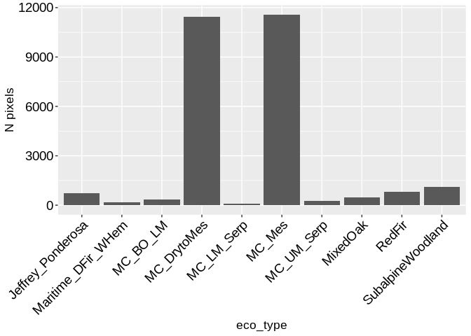
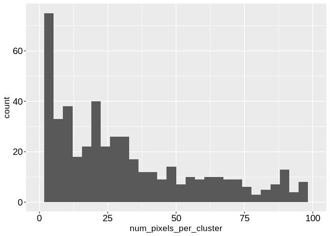
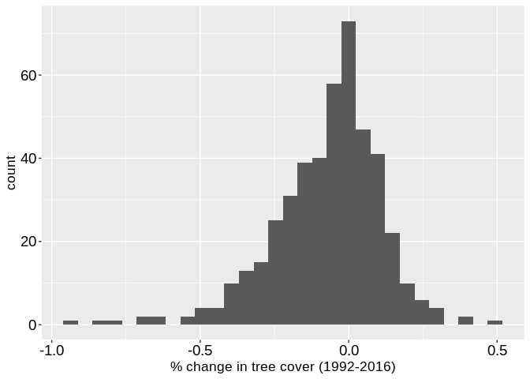
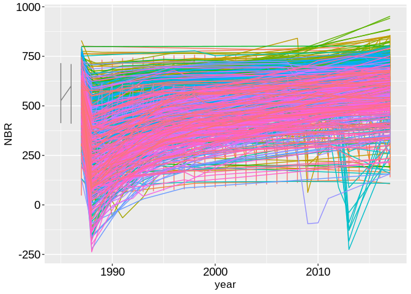
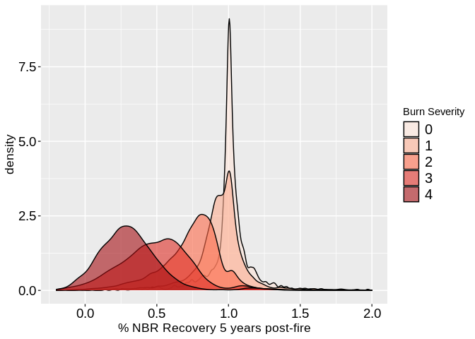
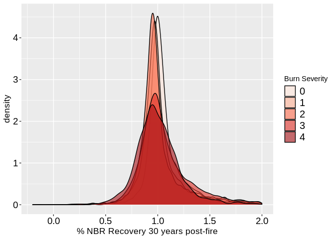
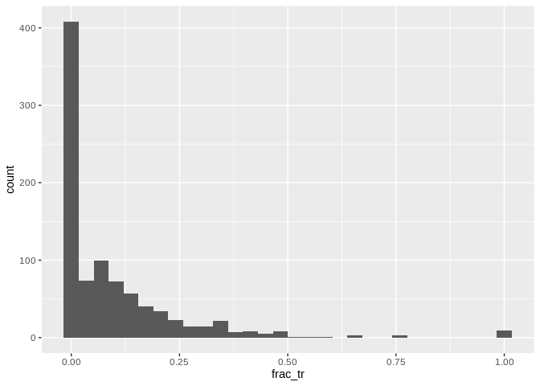

Install Packages

    library(tidyverse)

    ## ── Attaching packages ─────────────────────────────────────────────────────────────────────── tidyverse 1.3.0 ──

    ## ✓ ggplot2 3.3.0     ✓ purrr   0.3.3
    ## ✓ tibble  2.1.3     ✓ dplyr   0.8.5
    ## ✓ tidyr   1.0.2     ✓ stringr 1.4.0
    ## ✓ readr   1.3.1     ✓ forcats 0.5.0

    ## ── Conflicts ────────────────────────────────────────────────────────────────────────── tidyverse_conflicts() ──
    ## x dplyr::filter() masks stats::filter()
    ## x dplyr::lag()    masks stats::lag()

    source('scripts/adams_theme.R') #for ggplot2

Import data

    df <- read_csv('data/FireDataKlamath1987part1_v2.csv', col_types = cols(clusterID = col_factor())) %>%
      rbind(read_csv('data/FireDataKlamath1987part2_v2.csv', col_types = cols(clusterID = col_factor()))) %>%
      rbind(read_csv('data/FireDataKlamath1987part3_v2.csv', col_types = cols(clusterID = col_factor())))

    eco_type_codes <- read_csv('data/landfire_ecotype_codes.csv')

    ## Parsed with column specification:
    ## cols(
    ##   eco_type_code = col_double(),
    ##   eco_type_description = col_character()
    ## )

    n_pixels <- nrow(df)

clean data

    df <- df %>%
      select(-.geo, -'system:index') %>%
      #filter(FIRE_YEAR == 1994) %>%
      mutate(pixelID = as.character(1:n_pixels))

Identifying patches with more than eight pixels

    clusters_with_more_than8_pixels <- df %>% group_by(clusterID) %>%
      summarise(Npixels = length(unique(pixelID))) %>%
      filter(Npixels > 8) %>%
      pull(clusterID)

Creating a landcover data frame

    landcover <- names(df)[grep(names(df), pattern = "NLCD")]

    df_lc <- df %>%
      select(pixelID, clusterID, landcover) %>%
      gather(landcover, key = "NLCD_year", value = "landcover_code") %>%
      mutate(land_cover_name = case_when(
        (landcover_code == 71) ~ "grass_herb",
        (landcover_code == 51) ~ "shrub",
        (landcover_code == 42) ~ "evergreen_forest",
        (landcover_code == 43) ~ "mixed forest",
        (landcover_code == 31) ~ "barren_land",
        (landcover_code == 23) ~ "developed",
        (landcover_code == 41) ~ "deciduous_forest",
        (landcover_code == 11) ~ "open_water",
        (landcover_code == 81) ~ "pasture_hay",
        (landcover_code == 33) ~ "transitional_barren",
        (landcover_code == 52) ~ "shrub",
        (landcover_code == 21) ~ "developed",
        (landcover_code == 95) ~ "emergent_herb_wetlands",
        (landcover_code == 90) ~ "woody_wetlands",
        (landcover_code == 22) ~ "developed"
      )) %>%
      mutate(year = as.numeric(gsub("NLCD", "", NLCD_year))) %>%
      arrange(clusterID)

    ## Note: Using an external vector in selections is ambiguous.
    ## ℹ Use `all_of(landcover)` instead of `landcover` to silence this message.
    ## ℹ See <https://tidyselect.r-lib.org/reference/faq-external-vector.html>.
    ## This message is displayed once per session.

    df_lc

    ## # A tibble: 262,520 x 6
    ##    pixelID clusterID NLCD_year landcover_code land_cover_name   year
    ##    <chr>   <fct>     <chr>              <dbl> <chr>            <dbl>
    ##  1 1       0         NLCD1992              42 evergreen_forest  1992
    ##  2 2       0         NLCD1992              71 grass_herb        1992
    ##  3 3       0         NLCD1992              42 evergreen_forest  1992
    ##  4 4       0         NLCD1992              42 evergreen_forest  1992
    ##  5 5       0         NLCD1992              42 evergreen_forest  1992
    ##  6 6       0         NLCD1992              71 grass_herb        1992
    ##  7 7       0         NLCD1992              71 grass_herb        1992
    ##  8 8       0         NLCD1992              71 grass_herb        1992
    ##  9 9       0         NLCD1992              42 evergreen_forest  1992
    ## 10 10      0         NLCD1992              42 evergreen_forest  1992
    ## # … with 262,510 more rows

Creating a tree canopy cover df

    TCC <- names(df)[grep(names(df), pattern = "TCC")]

    df_tcc <- df %>%
      select(pixelID, clusterID, TCC) %>%
      gather(TCC, key = "TCCyear", value = "pct_TCC") %>% 
      mutate(year = as.numeric(gsub("TCC", "", TCCyear)))

    ## Note: Using an external vector in selections is ambiguous.
    ## ℹ Use `all_of(TCC)` instead of `TCC` to silence this message.
    ## ℹ See <https://tidyselect.r-lib.org/reference/faq-external-vector.html>.
    ## This message is displayed once per session.

    df_tcc

    ## # A tibble: 98,445 x 5
    ##    pixelID clusterID TCCyear pct_TCC  year
    ##    <chr>   <fct>     <chr>     <dbl> <dbl>
    ##  1 1       0         TCC2000      30  2000
    ##  2 2       0         TCC2000       1  2000
    ##  3 3       0         TCC2000      49  2000
    ##  4 4       0         TCC2000      61  2000
    ##  5 5       0         TCC2000      66  2000
    ##  6 6       0         TCC2000       0  2000
    ##  7 7       0         TCC2000       0  2000
    ##  8 8       0         TCC2000      57  2000
    ##  9 9       0         TCC2000      69  2000
    ## 10 10      0         TCC2000      54  2000
    ## # … with 98,435 more rows

Creating an NBR dataframe

    years <- as.character(1985:2017)
    df_nbr <- df %>%
      select(pixelID, clusterID, years) %>%
      gather(years, key = "year_string", value = "NBR") %>%
      mutate(year = as.numeric(year_string)) %>%
      select(-year_string, -clusterID) 

    ## Note: Using an external vector in selections is ambiguous.
    ## ℹ Use `all_of(years)` instead of `years` to silence this message.
    ## ℹ See <https://tidyselect.r-lib.org/reference/faq-external-vector.html>.
    ## This message is displayed once per session.

    df_nbr 

    ## # A tibble: 1,082,895 x 3
    ##    pixelID   NBR  year
    ##    <chr>   <dbl> <dbl>
    ##  1 1        745.  1985
    ##  2 2        617.  1985
    ##  3 3        414.  1985
    ##  4 4        682.  1985
    ##  5 5        729.  1985
    ##  6 6        764.  1985
    ##  7 7        489.  1985
    ##  8 8        603.  1985
    ##  9 9        736.  1985
    ## 10 10       632.  1985
    ## # … with 1,082,885 more rows

Creating a FACTS df

    facts_cols <- names(df)[grep(names(df), pattern = "facts")]
    df_facts <- df %>%
      select(pixelID, clusterID, facts_cols) %>%
      gather(facts_cols, key = "facts_year", value = "factsTreatmentCode") %>%
      mutate(factsTreatment = case_when(
        (factsTreatmentCode == 0) ~ "none",
        (factsTreatmentCode == 4431) ~ "plant_trees",
        (factsTreatmentCode == 4432) ~ "replant_or_fill"
      )) %>%
      mutate(year = as.numeric(gsub("facts", "", facts_year))) %>%
      arrange(clusterID)

    ## Note: Using an external vector in selections is ambiguous.
    ## ℹ Use `all_of(facts_cols)` instead of `facts_cols` to silence this message.
    ## ℹ See <https://tidyselect.r-lib.org/reference/faq-external-vector.html>.
    ## This message is displayed once per session.

    df_facts

    ## # A tibble: 1,050,080 x 6
    ##    pixelID clusterID facts_year factsTreatmentCode factsTreatment  year
    ##    <chr>   <fct>     <chr>                   <dbl> <chr>          <dbl>
    ##  1 1       0         facts1987                   0 none            1987
    ##  2 2       0         facts1987                   0 none            1987
    ##  3 3       0         facts1987                   0 none            1987
    ##  4 4       0         facts1987                   0 none            1987
    ##  5 5       0         facts1987                   0 none            1987
    ##  6 6       0         facts1987                   0 none            1987
    ##  7 7       0         facts1987                   0 none            1987
    ##  8 8       0         facts1987                   0 none            1987
    ##  9 9       0         facts1987                   0 none            1987
    ## 10 10      0         facts1987                   0 none            1987
    ## # … with 1,050,070 more rows

Merging dfs together

    #mering dfs together
    df <- df %>% select(pixelID, clusterID, FIRE_YEAR, FireID, burnSev, distance, northness, eastness, elevation, slope, b1, WID) %>%
      rename(ecotype_code = b1) %>%
      left_join(df_nbr, by = c("pixelID")) %>%
      left_join(df_lc,c("pixelID","year")) %>%
      left_join(df_facts,c("pixelID","year")) %>% 
      mutate(burnSevLong = case_when(
        (burnSev == 0) ~ "background/no_data",
        (burnSev == 1) ~ "verylow/no_burn",
        (burnSev == 2) ~ "low",
        (burnSev == 3) ~ "med",
        (burnSev == 4) ~ "high"
      )) %>% 
      mutate(eco_type = case_when(
        (ecotype_code == 549) ~ "MC_LM_Serp",
        (ecotype_code == 550) ~ "MC_UM_Serp",
        (ecotype_code == 551) ~ "MC_DrytoMes",
        (ecotype_code == 552) ~ "MC_Mes",
        (ecotype_code == 553) ~ "MixedOak",
        (ecotype_code == 554) ~ "MC_BO_LM",
        (ecotype_code == 555) ~ "Jeffrey_Ponderosa",
        (ecotype_code == 556) ~ "RedFir",
        (ecotype_code == 557) ~ "SubalpineWoodland",
        (ecotype_code == 558) ~ "Maritime_DFir_WHem"
      )) %>%
      filter(ecotype_code %in% eco_type_codes$eco_type_code) 

    df

    ## # A tibble: 1,003,068 x 24
    ##    pixelID clusterID.x FIRE_YEAR FireID burnSev distance northness eastness
    ##    <chr>   <fct>           <dbl> <chr>    <dbl>    <dbl>     <dbl>    <dbl>
    ##  1 1       0                1987 00000…       0        0    -0.563    0.827
    ##  2 1       0                1987 00000…       0        0    -0.563    0.827
    ##  3 1       0                1987 00000…       0        0    -0.563    0.827
    ##  4 1       0                1987 00000…       0        0    -0.563    0.827
    ##  5 1       0                1987 00000…       0        0    -0.563    0.827
    ##  6 1       0                1987 00000…       0        0    -0.563    0.827
    ##  7 1       0                1987 00000…       0        0    -0.563    0.827
    ##  8 1       0                1987 00000…       0        0    -0.563    0.827
    ##  9 1       0                1987 00000…       0        0    -0.563    0.827
    ## 10 1       0                1987 00000…       0        0    -0.563    0.827
    ## # … with 1,003,058 more rows, and 16 more variables: elevation <dbl>,
    ## #   slope <dbl>, ecotype_code <dbl>, WID <dbl>, NBR <dbl>, year <dbl>,
    ## #   clusterID.y <fct>, NLCD_year <chr>, landcover_code <dbl>,
    ## #   land_cover_name <chr>, clusterID <fct>, facts_year <chr>,
    ## #   factsTreatmentCode <dbl>, factsTreatment <chr>, burnSevLong <chr>,
    ## #   eco_type <chr>

    #adding the ecotype descriptions

Checking representation of forest types. Make this a table.

    #representation of forest types
    df %>%
      group_by(eco_type) %>%
      summarise(number_pixels = length(unique(pixelID))) %>%
      drop_na() %>%
      mutate(sample_area_hectares = number_pixels * 900 / 10000) %>%
      ggplot(aes(eco_type, number_pixels)) +
      geom_bar(stat = "identity") +
      adams_theme +
      theme(axis.text.x = element_text(angle = 45, hjust = 1)) +
      ylab(label = "N pixels")

    total_sample_area <- length(unique(df$pixelID)) * 900 / 10e4 
    total_sample_area 

    ## [1] 273.564

    total_number_patches <- length(unique(df$clusterID))
    total_number_patches

    ## [1] 600

Exploring patch size in hectares and pixels

    df %>%
      group_by(clusterID) %>%
      summarise(num_pixels_per_cluster = length(unique(pixelID))) %>%
      mutate(cluster_area = num_pixels_per_cluster * 900 / 10000) %>%
      pull(cluster_area) %>% summary()

    ## Warning: Factor `clusterID` contains implicit NA, consider using
    ## `forcats::fct_explicit_na`

    ##     Min.  1st Qu.   Median     Mean  3rd Qu.     Max. 
    ##    0.090    0.720    2.340    9.119    5.850 2735.640

    df %>%
      group_by(clusterID) %>%
      summarise(num_pixels_per_cluster = length(unique(pixelID))) %>%
      mutate(cluster_area = num_pixels_per_cluster * 900 / 10000) %>%
      ggplot(aes(num_pixels_per_cluster)) +
      geom_histogram() +
      xlim(c(0,100)) +
      adams_theme

    ## Warning: Factor `clusterID` contains implicit NA, consider using
    ## `forcats::fct_explicit_na`

    ## `stat_bin()` using `bins = 30`. Pick better value with `binwidth`.

    ## Warning: Removed 80 rows containing non-finite values (stat_bin).

    ## Warning: Removed 2 rows containing missing values (geom_bar).

    length(unique(df$pixelID))

    ## [1] 30396

    length(unique(df$pixelID)) * 900 / 10e4

    ## [1] 273.564

Quantifying how many pixels went from non-forest back to forest in their
post-fire regeneration trajectory

    `%notin%` <- Negate(`%in%`)

    nonForest2001 <- df %>%
      filter(year == 2001, landcover_code %notin% 41:43) %>%
      pull(pixelID) %>% unique()

    #how many pixels went from shrub to tree
    df %>%
      filter(pixelID %in% nonForest2001) %>%
      filter(year == 2016, landcover_code %in% 41:43) %>%
      pull(pixelID) %>% unique() %>% length()

    ## [1] 4576

Adding the percent NBR recovey to the df. %NBR recovery is the fraction
of mean pre-fire NBR

    #creating pre-fire NBR values for each pixel
    pre_fire_nbr <- df %>% 
      filter(year %in% 1985:1986) %>%
      group_by(pixelID) %>%
      summarise(preFireNBR = mean(NBR))

    #adding the percent NBR recovery to the df
    df <- df %>%
      left_join(pre_fire_nbr) %>%
      mutate(pct_nbr_recovery = NBR / preFireNBR)

    ## Joining, by = "pixelID"

Showing the distribution of NBR values for pixels classified as forest
for NLCD

    df %>%
      drop_na(land_cover_name) %>%
      filter(landcover_code %in% c(41:42, 71,51,52)) %>%
      ggplot(aes(x=NBR, fill=land_cover_name)) +
      geom_density( color="#e9ecef", alpha=0.6, position = 'identity') +
      scale_fill_manual(values=c("light green", "dark green", "yellow", "brown")) +
      #theme_ipsum() +
      labs(fill="") +
      adams_theme

plot patch-level NBR through time for a random sample of patches

    #patches <- sample(unique(df$clusterID),100)

    df %>%
      group_by(FireID, clusterID, year) %>%
      summarise_if(is.numeric,mean) %>%
      #filter(clusterID %in% patches) %>%
      ggplot(aes(year,NBR,color = clusterID)) +
      geom_line() +
      adams_theme +
      theme(legend.position = "none")

    ## Warning: Factor `clusterID` contains implicit NA, consider using
    ## `forcats::fct_explicit_na`

Calculating the percent NBR recovery for each patch

    #patches <- sample(unique(df$clusterID),10)
    df %>%
      group_by(clusterID, year) %>%
      #filter(WID > 0) %>%
      summarise_if(is.numeric,mean) %>%
      #filter(clusterID %in% patches) %>%
      ggplot(aes(year,pct_nbr_recovery,color = clusterID)) +
      geom_line() +
      ylim(c(-1,1.5)) +
      adams_theme +
      theme(legend.position = "none")

    ## Warning: Factor `clusterID` contains implicit NA, consider using
    ## `forcats::fct_explicit_na`

    ## Warning: Removed 625 row(s) containing missing values (geom_path).

Histogram of percent recovery in 2000 (6 years after fire)

    df %>%
      group_by(pixelID, year) %>%
      summarise_if(is.numeric,mean) %>%
      filter(year == 1992) %>%
      ggplot(aes(x = pct_nbr_recovery, fill = factor(burnSev))) +
      geom_density(alpha=0.6, position = 'identity') +
      scale_fill_brewer(palette = "Reds") +
      xlim(c(-0.2,2)) +
      xlab(label = "% NBR Recovery 5 years post-fire") +
      adams_theme +
      labs(fill="Burn Severity") 

    ## Warning: Removed 397 rows containing non-finite values (stat_density).

Density plot of percent recovery in 2017 (23 years after fire)

    df %>%
      group_by(pixelID, year) %>%
      summarise_if(is.numeric,mean) %>%
      filter(year == 2017) %>%
      ggplot(aes(x = pct_nbr_recovery, fill = factor(burnSev))) +
      geom_density(alpha=0.6, position = 'identity') +
      scale_fill_brewer(palette = "Reds") +
      xlim(c(-0.2,2)) +
      xlab(label = "% NBR Recovery 30 years post-fire") +
      adams_theme +
      labs(fill="Burn Severity") 

    ## Warning: Removed 1108 rows containing non-finite values (stat_density).

Creating variables showing the percent NBR recovery in 92,97,2017

    df <- df %>%
      filter(pct_nbr_recovery >= -10)

    pctNBRrec2017 <- df %>%
      filter(year == 2017) %>%
      select(pixelID, pct_nbr_recovery) %>%
      rename(pct_nbr_recovery_2017 = pct_nbr_recovery)

    pctNBRrec1997 <- df %>%
      filter(year == 1997) %>%
      select(pixelID, pct_nbr_recovery) %>%
      rename(pct_nbr_recovery_1997 = pct_nbr_recovery)

    pctNBRrec1992 <- df %>%
      filter(year == 1992) %>%
      select(pixelID, pct_nbr_recovery) %>%
      rename(pct_nbr_recovery_1992 = pct_nbr_recovery)

    df <- df %>%
      left_join(pctNBRrec2017) %>%
      left_join(pctNBRrec1997) %>%
      left_join(pctNBRrec1992)

    ## Joining, by = "pixelID"
    ## Joining, by = "pixelID"
    ## Joining, by = "pixelID"

Showing the perecent NBR recovery by burn severity class (10 years after
fire)

    # df %>%
    #   ggplot(aes(factor(burnSev), pct_nbr_recovery_1997)) +
    #   geom_boxplot() +
    #   ylim(c(0.2,1.5))

Showing the perecent NBR recovery by burn severity class (30 years after
fire)

    # df %>%
    #   ggplot(aes(factor(burnSev), pct_nbr_recovery_2017)) +
    #   geom_boxplot() +
    #   ylim(c(0.2,1.5))

Showing the relationship between distance (to the edge of a medium /
high severity burned area) and % NBR recovery in 2017 (26 years after
fire). This is commented out because it was crashing R studio.

    # pre_fire_pixels_forest <- df %>% filter(year == 1992, landcover_code %in% 41:42) %>% pull(pixelID) 
    # 
    # df %>%
    #   filter(pixelID %in% pre_fire_pixels_forest) %>%
    #   filter(burnSev >= 3) %>%
    #   ggplot(aes(distance, pct_nbr_recovery_2017)) +
    #   geom_point() +
    #   scale_x_continuous() +
    #   scale_y_continuous() +
    #   xlim(c(0,500)) +
    #   adams_theme

plot % tree cover over time for a random sample of clusters

    #create data frame of the change in forest cover for each cluster
    length(clusters_with_more_than8_pixels)

    ## [1] 455

    patches <- sample(clusters_with_more_than8_pixels,100)

    df %>%
      filter(burnSev > 1) %>%
      filter(clusterID %in% clusters_with_more_than8_pixels) %>%
      drop_na(land_cover_name) %>%
      group_by(clusterID,year) %>%
      summarise(pct_tree = sum(landcover_code %in% 41:43) / length(landcover_code)) %>%
      filter(clusterID %in% patches) %>%
      ggplot(aes(year,pct_tree,color = clusterID)) +
      geom_point() +
      geom_line() +
      adams_theme +
      theme(legend.position = "none") +
      scale_x_continuous(n.breaks = 7, limits = c(1992,2016)) +
      ylab(label = "Proportional Area Trees")

Whats the distribution in how much % tree canopy cover changed
throughout the regeneration trajectory?

    df %>%
      #filter(burnSev > 1) %>%
      filter(clusterID %in% clusters_with_more_than8_pixels) %>%
      #filter(WID > 0) %>%
      drop_na(land_cover_name) %>%
      group_by(clusterID,year) %>%
      summarise(pct_tree = sum(landcover_code %in% 41:43) / length(landcover_code),
                n_pixels = length(unique(pixelID))) %>%
      group_by(clusterID) %>%
      summarise(pct_change_tree = pct_tree[year==2016] - pct_tree[year==1992],
                n_pixels = head(n_pixels,1)) %>%
      ggplot(aes(pct_change_tree)) +
      geom_histogram() +
      adams_theme +
      xlab(label = "% change tree cover (2017-1992)")

    ## `stat_bin()` using `bins = 30`. Pick better value with `binwidth`.

    #A_mean = mean(values[value_type=="A"])

Calculate the patch-level independent variable (% change in forest
cover)

    patch_level_percent_change_in_forest_cover <- df %>%
      #filter(burnSev > 1) %>%
      filter(clusterID %in% clusters_with_more_than8_pixels) %>%
      drop_na(land_cover_name) %>%
      group_by(clusterID,year) %>%
      summarise(pct_tree = sum(landcover_code %in% 41:43) / length(landcover_code),
                n_pixels = length(unique(pixelID))) %>%
      group_by(clusterID) %>%
      summarise(pct_change_tree = pct_tree[year==2016] - pct_tree[year==1992],
                n_pixels = head(n_pixels,1))

    names(patch_level_percent_change_in_forest_cover)

    ## [1] "clusterID"       "pct_change_tree" "n_pixels"

Calculate patch-level continuous predictor vars

    patch_level_continuous_vars <- df %>%
      select(clusterID, pixelID, burnSev,northness,eastness,elevation,slope,preFireNBR, distance) %>%
      #mutate_at(vars(ecotype_code, factsTreatmentCode, WID),as.factor) %>%
      #filter(burnSev > 1) %>%
      filter(clusterID %in% clusters_with_more_than8_pixels) %>%
      group_by(clusterID) %>%
      summarise_if(is.numeric,mean)
    names(patch_level_continuous_vars)

    ## [1] "clusterID"  "burnSev"    "northness"  "eastness"   "elevation" 
    ## [6] "slope"      "preFireNBR" "distance"

Calculate patch-level categorical predictor vars

    getmode <- function(x) {
       uniqv <- unique(x)
       uniqv[which.max(tabulate(match(x, uniqv)))]
    }

    patch_level_categorical_vars <- df %>%
      select(clusterID,pixelID,ecotype_code, eco_type, factsTreatmentCode, WID) %>%
      mutate_at(vars(ecotype_code, eco_type, factsTreatmentCode, WID),as.factor) %>%
      #filter(burnSev > 1) %>%
      filter(clusterID %in% clusters_with_more_than8_pixels) %>%
      group_by(clusterID) %>%
      summarise_if(is.factor,getmode) 

    names(patch_level_categorical_vars)

    ## [1] "clusterID"          "ecotype_code"       "eco_type"          
    ## [4] "factsTreatmentCode" "WID"

Joining patch-level dataframes

    patch_data  <- patch_level_percent_change_in_forest_cover %>%
      left_join(patch_level_continuous_vars, by = "clusterID") %>%
      left_join(patch_level_categorical_vars, by = "clusterID") %>%
      select(-clusterID, -n_pixels)

    patch_data

    ## # A tibble: 454 x 12
    ##    pct_change_tree burnSev northness eastness elevation slope preFireNBR
    ##              <dbl>   <dbl>     <dbl>    <dbl>     <dbl> <dbl>      <dbl>
    ##  1         -0.0221 0.00500    0.0288   0.0259     1079.  19.2       598.
    ##  2         -0.0833 1.08      -0.774    0.627      1629.  28.0       653.
    ##  3         -0.375  3.31       0.643    0.731      1177.  26.8       536.
    ##  4         -0.105  3.32       0.395    0.850      1153.  26.4       481.
    ##  5         -0.20   3.1        0.365    0.914      1023   27.9       479.
    ##  6         -0.05   3.55       0.0851   0.866      1088.  26.2       494.
    ##  7         -0.198  1.95      -0.719    0.322       691.  24.5       624.
    ##  8         -0.0820 1.90      -0.664   -0.251       676.  23.1       715.
    ##  9         -0.337  2.13      -0.884   -0.271       791.  27.5       636.
    ## 10          0      2         -0.913   -0.211       516.  20.9       731.
    ## # … with 444 more rows, and 5 more variables: distance <dbl>,
    ## #   ecotype_code <fct>, eco_type <fct>, factsTreatmentCode <fct>, WID <fct>

Exploring correlations between variables

    library(ggcorrplot)

    corr <- patch_data %>%
      select_if(is.numeric) %>%
      cor() %>% round(1)

    Pmat <- patch_data %>%
      select_if(is.numeric) %>%
      cor_pmat()

    ggcorrplot(corr, hc.order = TRUE, type = "lower",
       lab = TRUE, p.mat = Pmat)

    patch_data %>%
      ggplot(aes(x = eco_type,y = pct_change_tree)) +
      geom_boxplot() +
      theme(axis.text.x = element_text(angle = 45, hjust = 1))

Analyzing the effect of planting trees on the future physiognomic class
in fire-affected pixels.

First look at % transitioning in treated and untreated pixels

    nonforest1992 <- df %>% 
      select(pixelID, year, landcover_code, factsTreatmentCode) %>%
      filter(year == 1992, landcover_code %notin% 41:43) %>% pull(pixelID)
    forest2016 <- df %>% 
      select(pixelID, year, landcover_code, factsTreatmentCode) %>%
      filter(year == 2016, landcover_code %in% 41:43) %>% pull(pixelID)
    transition2forest <- unique(df$pixelID[(df$pixelID %in% nonforest1992) & (df$pixelID %in% forest2016)])

    #transition2forest

    df %>%
      select(pixelID, year, landcover_code, factsTreatmentCode) %>%
      mutate(transitioned = pixelID %in% transition2forest) %>%
      mutate(planting = factsTreatmentCode %in% c(4431,4432)) %>%
      group_by(pixelID) %>%
      summarise(transitioned = max(transitioned), planted = max(planting)) %>%
      group_by(planted) %>%
      summarise(percent_trans = sum(transitioned) / length(transitioned), n = length(transitioned)) %>%
      ggplot(aes(factor(planted),percent_trans)) +
      geom_bar(stat = "identity")

Pixel-level data, difference of differences (i.e. t-test)

    facts_treatment_df <- df %>%
      filter(year > 1986) %>%
      select(clusterID, pixelID, year, landcover_code, factsTreatmentCode) %>%
      mutate(transitioned = pixelID %in% transition2forest) %>%
      mutate(planting = factsTreatmentCode %in% c(4431,4432)) %>%
      #filter(clusterID %in% cluster_with_treatment) %>%
      group_by(pixelID) %>% summarise(clusterID = first(clusterID), tr = first(transitioned), pl = max(planting)) %>%
      group_by(clusterID,pl) %>% summarise(n_tr = sum(tr), n = length(tr)) %>%
      mutate(frac_tr = n_tr / n) %>%
      mutate(lnfrac_tr = log(frac_tr + 0.000001))

    #treatGroup <- plantedVSnot %>% filter(pl == 1) %>% pull(frac_tr)

    #ControlGroup <- plantedVSnot %>% filter(pl == 0) %>% pull(frac_tr)

Visualizing data

    facts_treatment_df %>%
      ggplot(aes(factor(pl),frac_tr)) +
      geom_boxplot() +
      stat_summary(fun.y = mean, geom="point",colour="darkred", size=3) 

    ## Warning: `fun.y` is deprecated. Use `fun` instead.

    facts_treatment_df %>%
    ggplot(aes(frac_tr)) +
    geom_histogram()

    ## `stat_bin()` using `bins = 30`. Pick better value with `binwidth`.

    facts_treatment_df %>%
    ggplot(aes(log(frac_tr))) +
    geom_histogram()

    ## `stat_bin()` using `bins = 30`. Pick better value with `binwidth`.

    ## Warning: Removed 395 rows containing non-finite values (stat_bin).

    clusters_with_treatment <- facts_treatment_df %>%
      drop_na(clusterID) %>%
      group_by(clusterID) %>%
      summarise(nb = length(n)) %>%
      filter(nb > 1) %>% pull(clusterID)

    facts_treatment_df %>% filter(clusterID %in% clusters_with_treatment)

    ## # A tibble: 610 x 6
    ## # Groups:   clusterID [305]
    ##    clusterID      pl  n_tr     n frac_tr lnfrac_tr
    ##    <fct>       <int> <int> <int>   <dbl>     <dbl>
    ##  1 0               0   128  2004  0.0639     -2.75
    ##  2 0               1    35   201  0.174      -1.75
    ##  3 -1121539616     0     0     4  0         -13.8 
    ##  4 -1121539616     1     1     8  0.125      -2.08
    ##  5 -220987546      0     0     2  0         -13.8 
    ##  6 -220987546      1     0     2  0         -13.8 
    ##  7 -710819746      0     3   166  0.0181     -4.01
    ##  8 -710819746      1     0     1  0         -13.8 
    ##  9 -1768238605     0     0    84  0         -13.8 
    ## 10 -1768238605     1     0     8  0         -13.8 
    ## # … with 600 more rows

    t.test(lnfrac_tr ~ pl, 
           data = facts_treatment_df %>% filter(clusterID %in% clusters_with_treatment),
           paired = TRUE)

    ## 
    ##  Paired t-test
    ## 
    ## data:  lnfrac_tr by pl
    ## t = -4.2325, df = 304, p-value = 3.064e-05
    ## alternative hypothesis: true difference in means is not equal to 0
    ## 95 percent confidence interval:
    ##  -2.3944237 -0.8745765
    ## sample estimates:
    ## mean of the differences 
    ##                 -1.6345
